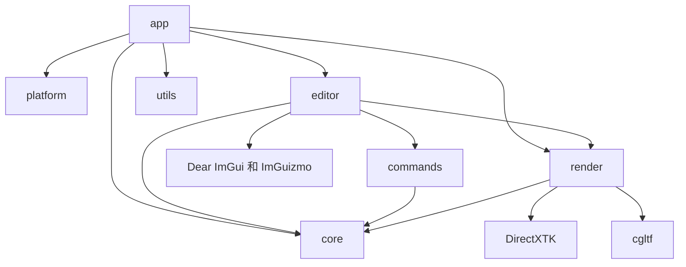

# FILE_INDEX - LRenderDemo

> 最后更新：2026-08-25 | 维护者：Codex

## 源文件

| 路径 | 用途 | 关键 API | 依赖项 |
|---|---|---|---|
| `src/app/Main.cpp` | GUI 入口和致命错误边界 | `wWinMain()` | Application、Logger |
| `src/app/Application.*` | 子系统生命周期和帧循环 | `Run()`、`Initialize()` | platform、editor、render、core |
| `src/platform/Window.*` | Win32 窗口和消息泵 | `Create()`、`PumpMessages()` | Win32、ImGui 后端 |
| `src/core/Transform.h` | 可编辑的变换值 | `ToMatrix()`、`NearlyEquals()` | SimpleMath |
| `src/core/Scene.*` | 基础几何/模型实体的稳定存储 | `CreateEntity()`、`CreateModelEntity()` | Transform、filesystem |
| `src/core/Camera.*` | 支持环绕/平移/缩放的编辑器相机 | `ViewMatrix()`、`ProjectionMatrix()` | SimpleMath |
| `src/commands/ICommand.h` | 可逆操作接口 | `Execute()`、`Undo()` | 无 |
| `src/commands/CommandHistory.*` | 有界撤销/重做栈 | `Execute()`、`PushApplied()` | ICommand |
| `src/commands/TransformCommand.*` | 可逆变换编辑 | `Execute()`、`Undo()` | Scene |
| `src/commands/CreateEntityCommand.*` | 可逆实体创建 | `Execute()`、`Undo()` | Scene |
| `src/render/IRenderEffect.h` | 逐网格的 Effect 边界 | `Bind()` | D3D11、SimpleMath |
| `src/render/BasicMeshEffect.*` | 纹理材质与多光源基础 Effect | `Bind()`、`Lights()` | Material、Lighting、D3DCompiler |
| `src/shaders/BasicMeshVS.hlsl` | 基础网格顶点变换和法线变换 | `VSMain()` | BasicMeshEffect 常量缓冲区 |
| `src/shaders/BasicMeshPS.hlsl` | BaseColor 采样、方向光/点光与高光 | `PSMain()` | BasicMeshEffect 常量缓冲区 |
| `src/render/Mesh.*` | 带 UV 的 D3D11 顶点/32 位索引缓冲区 | `Draw()` | D3D11、DirectXMath |
| `src/render/PrimitiveFactory.*` | 生成立方体、球体和平面 | `CreateCube()`、`CreateSphere()`、`CreatePlane()` | Mesh |
| `src/render/Texture2D.*` | WIC/DDS 文件、内存与生成纹理 | `LoadFile()`、`LoadMemory()` | DirectXTK、D3D11 |
| `src/render/SamplerState.*` | Sampler 描述与 D3D11 状态所有权 | `SamplerState()` | D3D11 |
| `src/render/Material.h`、`Lighting.h` | 基础材质和可编辑多光源数据 | `Material`、`LightingSettings` | Texture2D、SimpleMath |
| `src/render/Model.h`、`GltfLoader.*` | 静态 glTF/GLB 节点、网格与材质导入 | `GltfLoader::Load()` | cgltf、ResourceCache |
| `src/render/ResourceCache.*` | 按规范化路径缓存模型/纹理/Sampler | `LoadModel()`、`LoadTexture()` | GltfLoader、Texture2D |
| `src/render/RenderTarget.*` | 离屏视口的 RTV/SRV/DSV | `Resize()`、`BindAndClear()`、`Reset()` | D3D11 |
| `src/render/Dx11Renderer.*` | 设备、交换链和场景遍历 | `Initialize()`、`RenderScene()` | Effect、Mesh、RenderTarget |
| `src/editor/EditorLayer.*`、`EditorAssets.cpp` | 停靠面板、原生模型导入和光照控制 | `Draw()`、`ImportModel()` | Scene、Commands、Renderer、ImGui |
| `src/utils/Logger.*` | 按日期写入文件日志 | `Initialize()`、`Info()`、`Error()` | C++ filesystem |
| `tests/CoreTests.cpp` | CPU 行为回归测试 | 场景/命令测试用例 | LRenderCore |

## 配置和文档

| 路径 | 用途 |
|---|---|
| `CMakeLists.txt`、`src/CMakeLists.txt` | CMake 目标、VS 头文件分组、启动项目和 HLSL 构建规则 |
| `CMakePresets.json` | 可移植的 VS2022 x64 配置/构建/测试预设 |
| `cmake/Dependencies.cmake` | 固定版本的子模块目标定义 |
| `cmake/CompilerWarnings.cmake` | 第一方代码警告基线 |
| `scripts/bootstrap-and-verify.ps1` | 一条命令完成设置、构建、测试和启动 |
| `scripts/download-test-scenes.ps1` | 下载经典图形学测试模型并生成 SHA-256 清单 |
| `scripts/download-skybox-assets.ps1` | 下载固定版本的天空盒 cubemap DDS |
| `scripts/verify-learning-assets.ps1` | 按 SHA-256 清单校验学习路线必需素材 |
| `assets/test-scenes/README.md` | 测试模型来源、许可和学习用途索引 |
| `assets/skyboxes/README.md` | 天空盒素材来源、许可和下载说明 |
| `assets/learning-roadmap/README.md` | 将已下载素材映射到渲染效果实现阶段 |
| `README.md` | 环境要求、操作方式和调试指南 |
| `docs/architecture.md` | 生命周期、帧序列和 RHI 边界 |
| `docs/adding-an-effect.md` | Effect 扩展流程和学习顺序 |
| `docs/examples/skybox-pass.md` | 天空盒 Pass 的逐文件设计与实现示例 |
| `docs/directx11-feature-roadmap.md` | DX11 教程功能差距、实现顺序和验收标准 |
| `docs/model-import-and-material.md` | 纹理、材质、glTF/GLB、缓存与多光源学习指南 |
| `AGENTS.md` | 仓库专用开发规则 |
| `CHANGELOG.md` | 近期和历史变更 |
| `LESSONS.md` | 架构决策记录、问题和长期实践 |
| `SKILLS_USED.md` | 可复现的 Codex skill 使用记录 |
| `.env.example`、`.gitignore`、`.gitattributes` | 本地设置、排除规则和换行规则 |

## 模块依赖关系图

箭头 `A --> B` 表示 A 依赖 B。修改 B 时，需要检查所有指向 B 的模块。

## 模块职责

| 模块 | 职责 | 公共边界 | 依赖 | 变更影响 |
|---|---|---|---|---|
| `app/` | 生命周期和帧序列 | `Application::Run` | 所有运行时模块 | 整个应用程序 |
| `platform/` | 原生窗口和消息 | `Window` | Win32 | 启动和输入 |
| `editor/` | 面板和用户工作流 | `EditorLayer::Draw` | core、commands、render | 工具行为 |
| `commands/` | 可撤销的状态变更 | `ICommand`、`CommandHistory` | core | 编辑工作流 |
| `core/` | 与图形 API 无关的场景和相机数据 | `Scene`、`Camera`、`Transform` | 仅 SimpleMath | 编辑器和渲染器 |
| `render/` | DX11 资源和绘制执行 | `Dx11Renderer`、`IRenderEffect` | core、DX11、DirectXTK | 视觉输出 |
| `utils/` | 叶子工具模块 | `Logger` | C++ 标准库 | 仅诊断功能 |
| `tests/` | CPU 行为验证 | CTest 可执行文件 | LRenderCore | 回归保障 |
