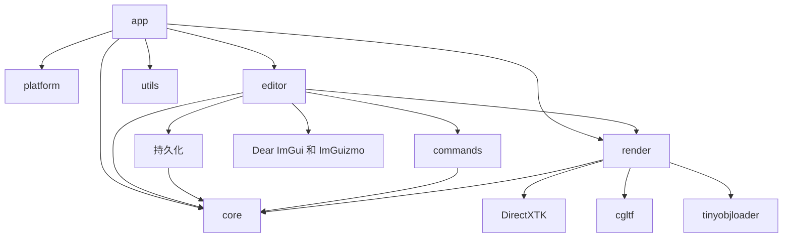

# FILE_INDEX - LRenderDemo

本次框架补充：`src/render/CommonConstants.h` 与 `src/shaders/common.hlsli` 定义公共 CBuffer；`src/core/ViewPort.*` 定义 API 无关视口；`src/render/IRenderEffect.cpp` 提供 Effect 基类辅助逻辑；`src/render/ColorProcessorEffect.*`、`src/shaders/QuadViewVS.hlsl` 和 `src/shaders/ColorProcessorPS.hlsl` 组成全屏后处理入口；`src/render/SkyCubeEffect.*` 保留天空盒 Effect 边界。详细设计见 `docs/render-framework-common-shader.md`。

> 最后更新：2026-08-31 | 维护者：Codex

## 源文件

| 路径 | 用途 | 关键 API | 依赖项 |
|---|---|---|---|
| `src/app/Main.cpp` | GUI 入口和致命错误边界 | `wWinMain()` | Application、Logger |
| `src/app/Application.*` | 子系统生命周期和帧循环 | `Run()`、`Initialize()` | platform、editor、render、core |
| `src/platform/Window.*` | Win32 窗口和消息泵 | `Create()`、`PumpMessages()` | Win32、ImGui 后端 |
| `src/core/Transform.h` | 可编辑的变换值 | `ToMatrix()`、`NearlyEquals()` | SimpleMath |
| `src/core/EntityMaterial.h` | 与图形 API 无关的实体材质参数 | `EntityMaterial`、`SurfaceDisplayMode` | SimpleMath、filesystem |
| `src/core/SolidGeometry.*` | Cube/Sphere/Plane 参数、校验和类型查询 | `SolidGeometry`、`SolidParameters` | SimpleMath、variant |
| `src/core/Scene.*` | `Scene -> Model -> Entity` 层级及 Solid/Mesh 几何描述 | `CreateModel()`、`CreateEntity()`、`CreateMeshEntity()` | Transform、EntityMaterial |
| `src/core/Camera.*` | 支持环绕、标准视角和自动旋转的编辑器相机 | `SetView()`、`RotateAroundTarget()` | SimpleMath |
| `src/core/ViewPort.*` | API 无关的视口尺寸、编号和相机状态 | `SetSize()`、`GetCamera()` | Camera |
| `src/commands/ICommand.h` | 可逆操作接口 | `Execute()`、`Undo()` | 无 |
| `src/commands/CommandHistory.*` | 有界撤销/重做栈 | `Execute()`、`PushApplied()` | ICommand |
| `src/commands/TransformCommand.*` | 可逆变换编辑 | `Execute()`、`Undo()` | Scene |
| `src/commands/CreateEntityCommand.*` | 可逆实体创建 | `Execute()`、`Undo()` | Scene |
| `src/commands/CreateModelCommand.*` | 可逆模型整体创建 | `Execute()`、`Undo()` | Scene |
| `src/commands/MaterialCommand.*` | 可逆实体材质编辑 | `Execute()`、`Undo()` | Scene、EntityMaterial |
| `src/commands/SolidGeometryCommand.*` | 可逆 Solid 参数编辑 | `Execute()`、`Undo()` | Scene、SolidGeometry |
| `src/render/EffectContext.*` | 从 Camera/Entity/Material 构造不可变的帧与绘制快照 | `EffectFrameContext`、`EffectDrawContext` | Camera、Scene、Material、D3D11 |
| `src/render/IRenderEffect.h` | 逐网格 Effect 的两 Context 绑定边界 | `Bind(frame, draw)` | EffectContext |
| `src/render/ColorProcessorEffect.*` | 全屏三角形颜色后处理 | `Apply()` | IRenderEffect、RenderTarget |
| `src/render/SkyCubeEffect.*` | 天空盒 Effect 边界（资源管线待接入） | `Bind()` | IRenderEffect |
| `src/render/Dx11ConstantBuffer.h` | 16 字节对齐的类型化 DX11 常量缓冲 RAII 封装 | `Update()`、`BindVS()`、`BindPS()` | D3D11、ComPtr |
| `src/render/CommonConstants.h` | BasicMesh C++ 常量布局 | `CommonConstants` | SimpleMath |
| `src/render/BasicMeshEffect.*` | 组装纹理材质与多光源常量并绑定基础管线 | `Bind()`、`Lights()` | CommonConstants、Dx11ConstantBuffer、D3DCompiler |
| `src/shaders/common.hlsli` | VS/PS 共用的 `b0` HLSL 常量布局 | `CommonConstants` cbuffer | 无 |
| `src/shaders/BasicMeshVS.hlsl` | 基础网格顶点变换和法线变换 | `VSMain()` | common.hlsli |
| `src/shaders/BasicMeshPS.hlsl` | BaseColor 采样、方向光/点光与高光 | `PSMain()` | common.hlsli |
| `src/render/Mesh.*` | 带 UV 的 D3D11 顶点/32 位索引缓冲区 | `Draw()` | D3D11、DirectXMath |
| `src/render/PrimitiveFactory.*`、`SolidMeshCache.*` | 按 Solid 参数生成并按 Entity 更新运行时 Mesh | `Create()`、`Resolve()` | SolidGeometry、Mesh、D3D11 |
| `src/render/Texture2D.*` | WIC/DDS 文件、内存与生成纹理 | `LoadFile()`、`LoadMemory()` | DirectXTK、D3D11 |
| `src/render/SamplerState.*` | Sampler 描述与 D3D11 状态所有权 | `SamplerState()` | D3D11 |
| `src/render/Material.h`、`Lighting.h` | 基础材质和可编辑多光源数据 | `Material`、`LightingSettings` | Texture2D、SimpleMath |
| `src/render/MeshAsset.h` | 导入资产的 Entity/Part、GPU Mesh 与材质边界 | `MeshAsset`、`MeshAssetEntity`、`MeshPart` | Mesh、Material |
| `src/render/IModelImporter.h`、`ModelLoader.*` | 按扩展名分发模型格式导入器 | `IModelImporter::Import()`、`ModelLoader::Load()` | GltfLoader、ObjLoader |
| `src/render/GltfLoader.*`、`ObjLoader.*`、`MeshImportUtils.*` | glTF/GLB 与 OBJ/MTL 静态网格导入 | `Import()` | cgltf、tinyobjloader、ResourceCache |
| `src/render/ResourceCache.*` | 按规范化路径缓存网格资产/纹理/Sampler | `LoadMeshAsset()`、`LoadTexture()` | ModelLoader、Texture2D |
| `src/render/RenderTarget.*` | 离屏视口的 RTV/SRV/DSV | `Resize()`、`BindAndClear()`、`Reset()` | D3D11 |
| `src/render/Dx11Renderer.*` | 设备、交换链、材质解析和场景遍历 | `RenderScene()`、`MaterialPreview()` | Effect、Mesh、ResourceCache |
| `src/editor/EditorLayer.*`、`EditorHierarchy.cpp`、`EditorAssets.cpp`、`EditorCamera.cpp`、`EditorMaterial.cpp` | Model/Entity 层级、资源、视角、材质和光照控制 | `Draw()`、`DrawHierarchy()`、`DrawMaterialEditor()` | Scene、Commands、Renderer、ImGui |
| `src/editor/EditorSolid.cpp`、`EditorScene.cpp` | 参数化创建/编辑与场景文件工作流 | `DrawSolidGeometryEditor()`、`SaveScene()` | SolidGeometry、SceneSerializer、原生对话框 |
| `src/persistence/SceneSerializer.*` | 版本化 `.lscene` JSON 原子保存和事务加载 | `Save()`、`Load()` | LRenderCore、nlohmann/json |
| `src/utils/Logger.*` | 按日期写入文件日志 | `Initialize()`、`Info()`、`Error()` | C++ filesystem |
| `tests/CoreTests.cpp` | CPU 行为回归测试 | 场景/命令测试用例 | LRenderCore |
| `tests/ImportTests.cpp`、`tests/assets/obj/` | WARP 支持的 OBJ/MTL 与资源缓存回归测试 | `LRenderImportTests` | LRenderAssets、D3D11 WARP |

## 配置和文档

| 路径 | 用途 |
|---|---|
| `CMakeLists.txt`、`src/CMakeLists.txt` | CMake 目标、VS 头文件分组、启动项目和 HLSL 构建规则 |
| `CMakePresets.json` | 可移植的 VS2022 x64 配置/构建/测试预设 |
| `cmake/Dependencies.cmake` | 固定版本的子模块目标定义 |
| `cmake/CompilerWarnings.cmake` | 第一方代码警告基线 |
| `scripts/bootstrap-and-verify.ps1` | 一条命令完成设置、构建、测试和启动 |
| `scripts/download-test-scenes.ps1` | 下载经典图形学测试模型并生成 SHA-256 清单 |
| `scripts/download-skybox-assets.ps1` | 下载固定版本的天空盒 cubemap DDS |
| `scripts/verify-learning-assets.ps1` | 按 SHA-256 清单校验学习路线必需素材 |
| `assets/test-scenes/README.md` | 测试模型来源、许可和学习用途索引 |
| `assets/skyboxes/README.md` | 天空盒素材来源、许可和下载说明 |
| `assets/learning-roadmap/README.md` | 将已下载素材映射到渲染效果实现阶段 |
| `README.md` | 环境要求、操作方式和调试指南 |
| `docs/architecture.md` | 生命周期、帧序列和 RHI 边界 |
| `docs/adding-an-effect.md` | Effect 扩展流程和学习顺序 |
| `docs/examples/skybox-pass.md` | 天空盒 Pass 的逐文件设计与实现示例 |
| `docs/directx11-feature-roadmap.md` | DX11 教程功能差距、实现顺序和验收标准 |
| `docs/model-import-and-material.md` | 纹理、材质、glTF/GLB、缓存与多光源学习指南 |
| `docs/parameterized-solid-and-scene-save.md` | 参数化 Solid、实时编辑、运行时 Mesh 和场景保存指南 |
| `AGENTS.md` | 仓库专用开发规则 |
| `CHANGELOG.md` | 近期和历史变更 |
| `LESSONS.md` | 架构决策记录、问题和长期实践 |
| `SKILLS_USED.md` | 可复现的 Codex skill 使用记录 |
| `.env.example`、`.gitignore`、`.gitattributes` | 本地设置、排除规则和换行规则 |

## 模块依赖关系图

箭头 `A --> B` 表示 A 依赖 B。修改 B 时，需要检查所有指向 B 的模块。

## 模块职责

| 模块 | 职责 | 公共边界 | 依赖 | 变更影响 |
|---|---|---|---|---|
| `app/` | 生命周期和帧序列 | `Application::Run` | 所有运行时模块 | 整个应用程序 |
| `platform/` | 原生窗口和消息 | `Window` | Win32 | 启动和输入 |
| `editor/` | 面板和用户工作流 | `EditorLayer::Draw` | core、commands、render | 工具行为 |
| `commands/` | 可撤销的状态变更 | `ICommand`、`CommandHistory` | core | 编辑工作流 |
| `core/` | 与图形 API 无关的场景和相机数据 | `Scene`、`Camera`、`Transform` | 仅 SimpleMath | 编辑器和渲染器 |
| `render/` | DX11 资源和绘制执行 | `Dx11Renderer`、`IRenderEffect` | core、DX11、DirectXTK | 视觉输出 |
| `persistence/` | 场景文件保存和加载 | `SceneSerializer` | core、nlohmann/json | 文件兼容性 |
| `utils/` | 叶子工具模块 | `Logger` | C++ 标准库 | 仅诊断功能 |
| `tests/` | 场景 CPU 行为和 WARP 资源导入验证 | CTest 可执行文件 | LRenderCore、LRenderAssets | 回归保障 |
