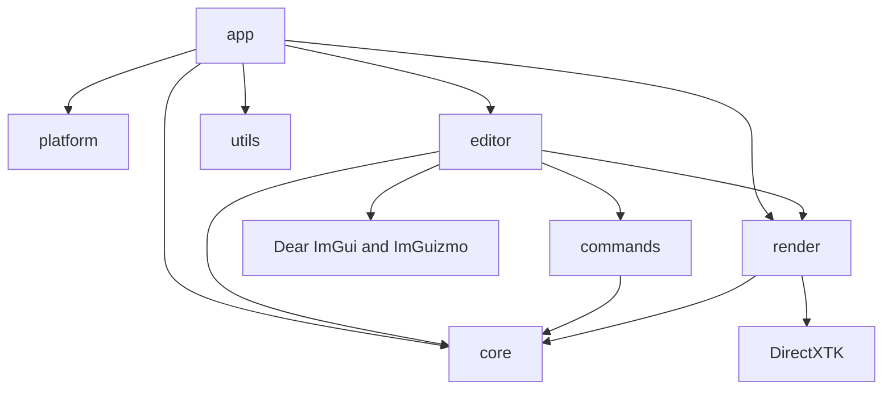

# FILE_INDEX - LRenderDemo

> Last updated: 2026-08-20 | Maintained by Codex

## Source files

| Path | Purpose | Key API | Dependencies |
|---|---|---|---|
| `src/app/Main.cpp` | GUI entry and fatal-error boundary | `wWinMain()` | Application, Logger |
| `src/app/Application.*` | Subsystem lifetime and frame loop | `Run()`, `Initialize()` | platform, editor, render, core |
| `src/platform/Window.*` | Win32 window and message pump | `Create()`, `PumpMessages()` | Win32, ImGui backend |
| `src/core/Transform.h` | Editable transform value | `ToMatrix()`, `NearlyEquals()` | SimpleMath |
| `src/core/Scene.*` | Stable entity storage | `CreateEntity()`, `RemoveEntity()` | Transform |
| `src/core/Camera.*` | Orbit/pan/zoom editor camera | `ViewMatrix()`, `ProjectionMatrix()` | SimpleMath |
| `src/commands/ICommand.h` | Reversible operation contract | `Execute()`, `Undo()` | none |
| `src/commands/CommandHistory.*` | Bounded undo/redo stacks | `Execute()`, `PushApplied()` | ICommand |
| `src/commands/TransformCommand.*` | Reversible transform edit | `Execute()`, `Undo()` | Scene |
| `src/commands/CreateEntityCommand.*` | Reversible entity creation | `Execute()`, `Undo()` | Scene |
| `src/render/IRenderEffect.h` | Per-mesh Effect boundary | `Bind()` | D3D11, SimpleMath |
| `src/render/BasicMeshEffect.*` | DirectXTK lit Effect | `Bind()` | BasicEffect, CommonStates |
| `src/render/Mesh.*` | D3D11 vertex/index buffer owner | `Draw()` | D3D11, VertexTypes |
| `src/render/PrimitiveFactory.*` | Cube/sphere generation | `CreateCube()`, `CreateSphere()` | Mesh |
| `src/render/RenderTarget.*` | Offscreen viewport RTV/SRV/DSV | `Resize()`, `BindAndClear()` | D3D11 |
| `src/render/Dx11Renderer.*` | Device, swap chain, scene traversal | `Initialize()`, `RenderScene()` | Effect, Mesh, RenderTarget |
| `src/editor/EditorLayer.*` | Docking panels and manipulation | `Draw()` | Scene, Commands, Renderer, ImGui |
| `src/utils/Logger.*` | Daily file logging | `Initialize()`, `Info()`, `Error()` | C++ filesystem |
| `tests/CoreTests.cpp` | CPU behavior regression tests | scene/command test cases | LRenderCore |

## Configuration and documentation

| Path | Purpose |
|---|---|
| `CMakeLists.txt`, `src/CMakeLists.txt` | CMake targets and VS startup project |
| `CMakePresets.json` | Portable VS2022 x64 configure/build/test presets |
| `cmake/Dependencies.cmake` | Pinned submodule target definitions |
| `cmake/CompilerWarnings.cmake` | First-party warning baseline |
| `scripts/bootstrap-and-verify.ps1` | One-command setup, build, test, and launch |
| `README.md` | Prerequisites, controls, and debugging guide |
| `docs/architecture.md` | Lifetime, frame sequence, and RHI boundary |
| `docs/adding-an-effect.md` | Effect extension workflow and learning order |
| `AGENTS.md` | Repository-specific development rules |
| `CHANGELOG.md` | Recent and historical changes |
| `LESSONS.md` | ADRs, pitfalls, and durable practices |
| `SKILLS_USED.md` | Reproducible Codex skill record |
| `.env.example`, `.gitignore`, `.gitattributes` | Local settings, exclusions, and line endings |

## Module dependency graph

Arrow `A --> B` means A depends on B. Changes to B require checking every incoming module.

## Module responsibilities

| Module | Responsibility | Public boundary | Depends on | Change impact |
|---|---|---|---|---|
| `app/` | Lifetime and frame sequencing | `Application::Run` | all runtime modules | Whole application |
| `platform/` | Native window and messages | `Window` | Win32 | Startup and input |
| `editor/` | Panels and user workflows | `EditorLayer::Draw` | core, commands, render | Tool behavior |
| `commands/` | Undoable state mutations | `ICommand`, `CommandHistory` | core | Editing workflows |
| `core/` | API-neutral scene and camera data | `Scene`, `Camera`, `Transform` | SimpleMath only | Editor and renderer |
| `render/` | DX11 resources and draw execution | `Dx11Renderer`, `IRenderEffect` | core, DX11, DirectXTK | Visual output |
| `utils/` | Leaf utilities | `Logger` | C++ standard library | Diagnostics only |
| `tests/` | CPU behavior verification | CTest executable | LRenderCore | Regression confidence |
