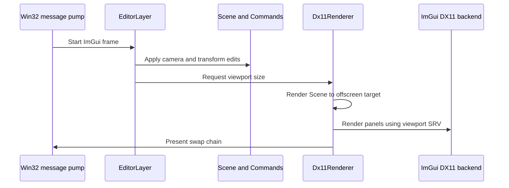

# Architecture

## Design goal

The application is deliberately smaller than a game engine. DX11 concepts remain visible while
editor and scene code are kept independent enough to survive a future RHI migration.

## Frame sequence

## Ownership

- `Application` owns subsystem lifetime and the frame loop.
- `Window` owns only the Win32 `HWND` and message state.
- `Dx11Renderer` owns GPU objects, procedural meshes, and active Effects.
- `Scene` owns editable entity data but no GPU resources.
- `EditorLayer` converts user interaction into scene edits and commands.
- `CommandHistory` owns reversible operations and has no UI dependency.
- Each render technique derives from `IRenderEffect` or becomes a later render-pass class.

## RHI migration boundary

Do not introduce a generic RHI while only DX11 is being learned. Keep native objects inside
`src/render/` and avoid leaking them into `core/`, `commands/`, or `editor/`. When a second backend
is implemented, extract interfaces from the proven DX11 operations and add `render/rhi/` plus
backend modules. Scene and command code should require no changes.

## Resource lifetime

COM resources use `Microsoft::WRL::ComPtr`. CPU ownership uses values or `std::unique_ptr`.
Shutdown order is UI backend, Effect/meshes/targets, D3D context, swap chain, device, and window.
