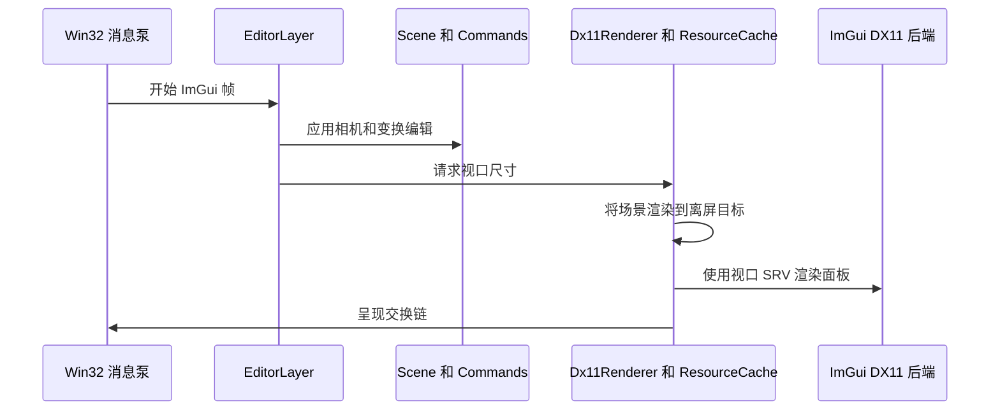
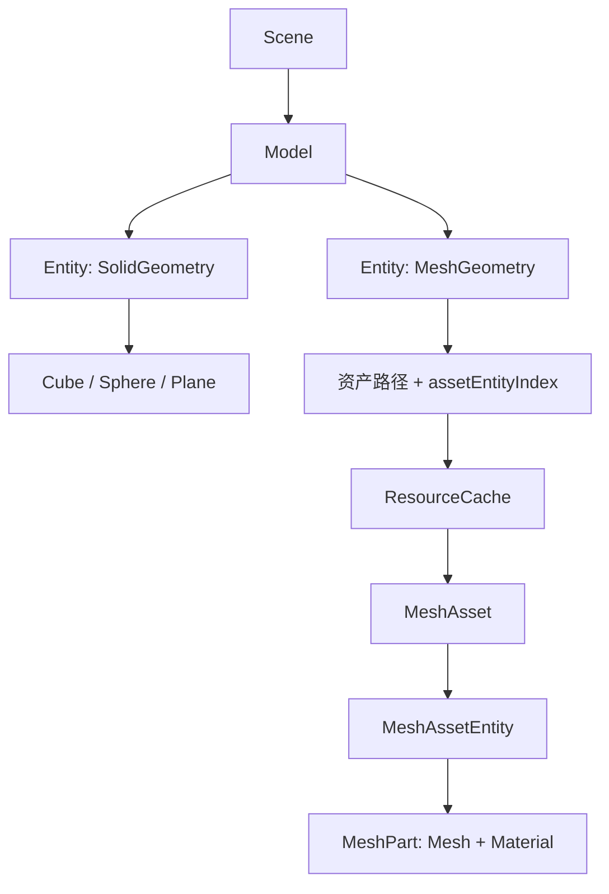

# 架构说明

## 设计目标

本应用有意保持在比游戏引擎更小的规模。DX11 概念在代码中保持可见，同时编辑器和场景代码具有
足够的独立性，以便将来迁移到 RHI 时继续复用。

## 帧执行序列

## 所有权关系

- `Application` 负责子系统生命周期和帧循环。
- `Window` 只负责 Win32 `HWND` 和消息状态。
- `Dx11Renderer` 负责 GPU 对象、程序化网格、资源缓存和当前启用的 Effects。
- `ResourceCache` 按规范化路径复用 `MeshAsset` 和纹理，并按描述复用 Sampler；缓存与 D3D 设备同生命周期。
- `Scene` 管理 `Model`，每个 `Model` 管理一组 `Entity`。同一 Model 可以同时包含 Solid Entity 和
  Mesh Entity；场景层只保存基础几何类型或网格资产路径/索引，不持有 GPU 资源。
- `EditorLayer` 将用户交互转换为场景编辑和命令。
- `CommandHistory` 负责可逆操作，且不依赖界面。
- 每项渲染技术派生自 `IRenderEffect`，或实现为后续的渲染 Pass 类。

## 场景与资源层级

场景 `Model` 是编辑器所有权和分组概念；渲染层 `MeshAsset` 是按路径缓存的导入结果。两者名称和
职责刻意分开。全局唯一 `EntityId` 让变换/材质命令不必知道实体属于哪个 Model；创建实体时则必须
携带 `ModelId`。导入一个文件会创建一个 Model，文件内的 glTF Mesh Node 或 OBJ Shape 会分别成为
Mesh Entity。之后可继续向该 Model 添加 Solid Entity，并由同一场景遍历绘制。

## 模型格式扩展边界

`ResourceCache::LoadMeshAsset()` 负责路径缓存，`ModelLoader` 只负责按扩展名选择 `IModelImporter`。
当前注册 `GltfLoader` 和 `ObjLoader`。以后接入 Assimp 时新增一个实现 `IModelImporter` 的类并注册
FBX 等扩展名即可；场景层级、编辑器导入流程、渲染器和缓存的公共接口无需改变。

## RHI 迁移边界

仅学习 DX11 时，不应引入通用 RHI。将原生对象限制在 `src/render/` 中，避免它们泄漏到
`core/`、`commands/` 或 `editor/`。实现第二个后端时，再从已经验证的 DX11 操作中提取接口，
并新增 `render/rhi/` 和对应后端模块。场景和命令代码应无需改动。

## 资源生命周期

COM 资源使用 `Microsoft::WRL::ComPtr`。CPU 对象通过值语义、`std::unique_ptr` 或缓存共享所需的
`std::shared_ptr` 管理。关闭顺序依次为：UI 后端、Effect、网格资产/纹理缓存、程序化网格/目标、
D3D 上下文、交换链、设备、COM apartment 和窗口。
