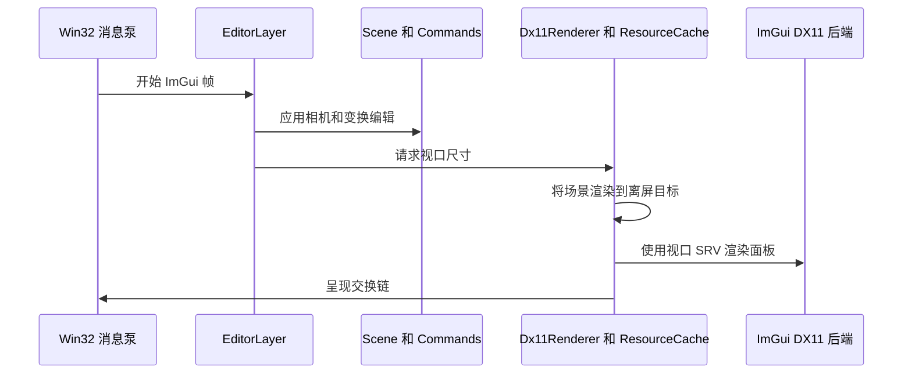
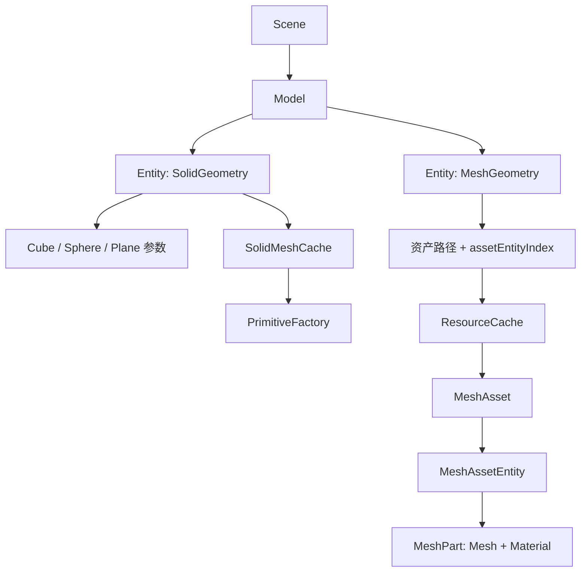
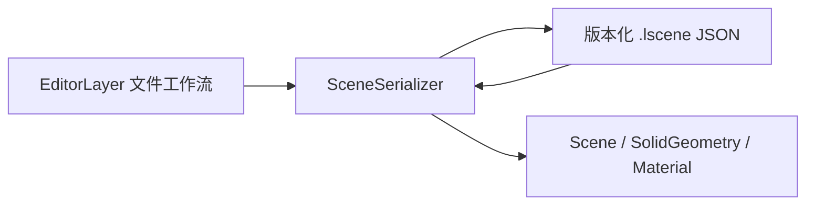
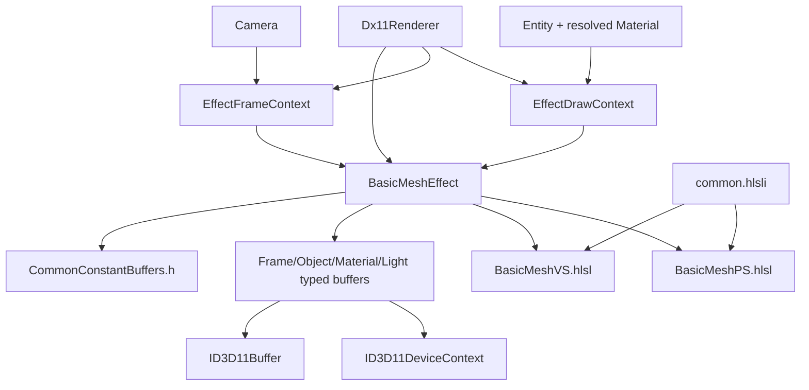

# 架构说明

## 设计目标

本应用有意保持在比游戏引擎更小的规模。DX11 概念在代码中保持可见，同时编辑器和场景代码具有
足够的独立性，以便将来迁移到 RHI 时继续复用。

## 帧执行序列

## 所有权关系

- `Application` 负责子系统生命周期和帧循环。
- `Window` 只负责 Win32 `HWND` 和消息状态。
- `Dx11Renderer` 负责 GPU 对象、参数化 Solid 的运行时 Mesh、资源缓存和当前启用的 Effects。
- `ResourceCache` 按规范化路径复用 `MeshAsset` 和纹理，并按描述复用 Sampler；缓存与 D3D 设备同生命周期。
- `Scene` 管理 `Model`，每个 `Model` 管理一组 `Entity`。同一 Model 可以同时包含 Solid Entity 和
  Mesh Entity；Solid 保存尺寸/半径/细分参数，Mesh 保存资产路径/索引，场景层不持有 GPU 资源。
- `EditorLayer` 将用户交互转换为场景编辑和命令。
- `CommandHistory` 负责可逆操作，且不依赖界面。
- 每项渲染技术派生自 `IRenderEffect`，或实现为后续的渲染 Pass 类。

## 场景与资源层级

场景 `Model` 是编辑器所有权和分组概念；渲染层 `MeshAsset` 是按路径缓存的导入结果。两者名称和
职责刻意分开。全局唯一 `EntityId` 让变换/材质命令不必知道实体属于哪个 Model；创建实体时则必须
携带 `ModelId`。导入一个文件会创建一个 Model，文件内的 glTF Mesh Node 或 OBJ Shape 会分别成为
Mesh Entity。之后可继续向该 Model 添加 Solid Entity，并由同一场景遍历绘制。

`SolidMeshCache` 按 `EntityId` 保存当前参数对应的 DX11 Mesh。Inspector 实时修改参数时，只替换该
Entity 的 Mesh；删除实体后，渲染遍历会清理失效缓存。参数是可保存的真实来源，Mesh 只是运行时产物。

## 场景持久化边界

`LRenderPersistence` 依赖 `LRenderCore` 和固定版本 `nlohmann/json`，Core 不依赖 JSON。保存记录场景
语义和外部资源引用，不记录 GPU 对象或缓存。加载先创建临时 Scene，编辑器再预加载资源，成功后才
替换当前场景并清空运行时 Solid Mesh 和命令历史。

## 模型格式扩展边界

`ResourceCache::LoadMeshAsset()` 负责路径缓存，`ModelLoader` 只负责按扩展名选择 `IModelImporter`。
当前注册 `GltfLoader` 和 `ObjLoader`。以后接入 Assimp 时新增一个实现 `IModelImporter` 的类并注册
FBX 等扩展名即可；场景层级、编辑器导入流程、渲染器和缓存的公共接口无需改变。

## Effect 与常量缓冲边界

`Dx11ConstantBuffer<T>` 只封装类型大小检查、`ComPtr` 所有权、数据更新和 VS/PS 槽位绑定。
`CommonConstantBuffers` 由 `Dx11Renderer` 持有，每种公共 CBuffer 只创建一份；`EffectFrameContext` 只
借用它。Renderer 在每帧开始上传 Frame 和 Light，BasicMeshEffect 在每个网格绘制前更新 Object 和
Material。C++ 与 HLSL 布局分别位于独立文件，VS/PS 通过同一个 `.hlsli` 消除重复声明。

`Dx11Renderer` 每帧从 Camera 构造一次 `EffectFrameContext`，每个 MeshPart 从 Entity、解析后的
Material 和选择 ID 构造一个 `EffectDrawContext`，然后调用 `Draw(frame, draw)`。两个 Context 是
并列的不可变快照，不继承共同父类，也不会被 Effect 跨调用保存。`Bind(frame, draw)` 仍作为低层
管线绑定接口保留；高层 `Draw` 可以在 Effect 内部按顺序执行多个 Pass，并调用 Mesh 的绘制入口。

`IRenderEffect` 不再持有通用资源注册表。具体 Effect 通过显式成员管理资源：二维颜色/深度目标使用
`EffectResource`，Cubemap 使用 `EffectCubeMapResource`，普通共享纹理继续由 `ResourceCache` 管理。
多 Pass Effect 可以直接持有多个具名成员，例如 `m_blurResource` 和 `m_bloomResource`，在同一个
`Draw` 中完成 RTV/SRV 切换。这种所有权可以直接在调试器中观察，也避免依赖字符串查找。

四类公共缓冲按 Frame/Object/Material/Light 拆分，并由 Renderer 统一拥有。Buffer 对象只创建一次，
但 Object 和 Material 会在每个绘制项之间复用并更新。后续出现 DeferredContext 或多设备时，应按
Context/Device 各自创建一组，不要改成进程级静态对象。

## RHI 迁移边界

仅学习 DX11 时，不应引入通用 RHI。将原生对象限制在 `src/render/` 中，避免它们泄漏到
`core/`、`commands/` 或 `editor/`。实现第二个后端时，再从已经验证的 DX11 操作中提取接口，
并新增 `render/rhi/` 和对应后端模块。场景和命令代码应无需改动。

## 资源生命周期

COM 资源使用 `Microsoft::WRL::ComPtr`。CPU 对象通过值语义、`std::unique_ptr` 或缓存共享所需的
`std::shared_ptr` 管理。关闭顺序依次为：UI 后端、Effect、网格资产/纹理缓存、程序化网格/目标、
D3D 上下文、交换链、设备、COM apartment 和窗口。
