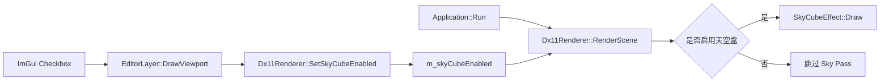

# 编辑器控件到渲染层的调试流程

本文以天空盒启用开关为例，说明 ImGui 控件如何把状态传递到渲染层，以及如何在 Visual Studio 中跟踪一条完整的调用链。

## 当前调用链

应用每帧按照固定顺序执行编辑器和渲染器：

```cpp
m_editor.Draw(m_scene, m_history, m_camera, m_renderer);
m_renderer.RenderScene(m_scene, m_camera, m_editor.SelectedEntityId());
```

因此，编辑器在 `Draw()` 中修改的 Renderer 状态，会在同一帧后续的 `RenderScene()` 中被读取。



## 控件层

当前控件位于 `EditorLayer::DrawViewport()`：

```cpp
bool skyCubeEnabled = renderer.IsSkyCubeEnabled();
if (ImGui::Checkbox("Sky Cube", &skyCubeEnabled))
{
    renderer.SetSkyCubeEnabled(skyCubeEnabled);
}
```

这里使用局部变量接收当前状态，再把 Checkbox 的修改结果写回 Renderer。这样每帧打开面板时，控件显示的值都来自真实渲染状态，不会出现 UI 和 Renderer 不同步。

`ImGui::Checkbox()` 返回 `true` 表示用户在本帧改变了控件。如果返回 `false`，不会重复写入 Renderer。

## Renderer 状态

`Dx11Renderer` 保存天空盒开关：

```cpp
bool m_skyCubeEnabled = true;
```

setter 和 getter 位于 `Dx11Renderer`：

```cpp
void Dx11Renderer::SetSkyCubeEnabled(bool enabled) noexcept
{
    m_skyCubeEnabled = enabled;
}

bool Dx11Renderer::IsSkyCubeEnabled() const noexcept
{
    return m_skyCubeEnabled;
}
```

它们只负责保存和读取状态，不直接执行绘制。这样 Editor 不需要知道 `SkyCubeEffect` 的 Shader、Cubemap 或 DX11 状态细节。

## RenderScene 中的判断

天空盒绘制属于场景渲染中的一个 Pass：

```cpp
if (m_skyCubeEnabled)
{
    frameContext.CapturePipelineState();
    m_skyCubeEffect->Draw(frameContext);
    frameContext.ResetPipelineState();
}
```

当前场景渲染顺序是：

```text
清理 Scene RenderTarget
    -> BeginFrame
    -> 不透明物体 Pass
    -> Sky Pass（由 m_skyCubeEnabled 决定）
    -> ColorProcessor 后处理 Pass
    -> 显示到 ImGui Viewport
```

关闭天空盒时，只跳过 `SkyCubeEffect::Draw()`，不会销毁 Cubemap，也不会重新创建 Shader。再次打开时可以直接恢复绘制。

## Visual Studio 调试步骤

建议按下面的顺序设置断点：

1. 在 `EditorLayer.cpp` 的 `renderer.SetSkyCubeEnabled(skyCubeEnabled);` 设置断点。
2. 启动 Debug 版本，点击 Viewport 中的 `Sky Cube`。
3. 观察 `skyCubeEnabled`，确认它从 `true` 变成 `false`，或从 `false` 变成 `true`。
4. 单步进入 `Dx11Renderer::SetSkyCubeEnabled()`，确认 `m_skyCubeEnabled` 被更新。
5. 在 `Dx11Renderer::RenderScene()` 的 `if (m_skyCubeEnabled)` 设置断点。
6. 关闭开关时，代码不应进入大括号内部。
7. 打开开关时，代码应进入 `SkyCubeEffect::Draw()`。
8. 进入 `SkyCubeEffect::Draw()` 后，可以继续观察 Cubemap SRV、Sampler、Rasterizer 和自定义深度状态的绑定。

如果 Checkbox 状态变化但画面没有变化，优先检查：

```text
EditorLayer::Draw() 是否在 RenderScene() 之前执行
setter 是否真的被调用
RenderScene() 是否读取同一个 m_skyCubeEnabled
SkyCubeEffect::Draw() 是否被条件分支跳过
```

## 为什么不让控件直接调用 SkyCubeEffect

下面这种调用会让编辑器依赖具体 Effect：

```cpp
renderer.SkyCubeEffect().SetEnabled(false);
```

它会把 Shader、资源和渲染流程的细节暴露给 UI。后续如果天空盒改成环境光、全屏背景或多个 Sky Pass，编辑器接口会被迫跟着改变。

当前推荐的边界是：

```text
EditorLayer：修改用户可见的渲染选项
Dx11Renderer：保存选项并编排 Pass
SkyCubeEffect：执行具体 GPU 绘制
```

## 临时调试状态和场景状态

当前 `m_skyCubeEnabled` 属于 Renderer 的临时调试状态：

- 不进入 `Scene`。
- 不进入 `CommandHistory`。
- 不参与 `.lscene` 保存。
- 程序重启后恢复默认值 `true`。

这种方式适合：

- 法线显示模式。
- 线框模式。
- RenderTarget 调试。
- 天空盒临时开关。
- OIT 算法切换。

如果天空盒开关以后要作为场景内容保存，则应移动到场景渲染设置：

```cpp
struct SceneRenderSettings
{
    bool skyCubeEnabled = true;
};
```

调用关系会变为：

```text
EditorLayer 修改 SceneRenderSettings
    -> CommandHistory 记录修改（可选）
    -> SceneSerializer 保存和加载
    -> Application 将设置传给 RenderScene
    -> Dx11Renderer 根据设置执行 Sky Pass
```

这时 Checkbox 的修改可以被撤销、重做，也可以随场景文件恢复。

## 继续扩展控件的通用模式

新增一个简单的渲染调试开关时，可以遵循以下模板：

```text
1. 在 Dx11Renderer 中增加状态成员。
2. 在 .h 中增加 setter/getter 声明。
3. 在 .cpp 中实现 setter/getter。
4. 在 EditorLayer 中通过 getter 初始化控件。
5. 控件改变时调用 setter。
6. 在 RenderScene 或对应 Pass 中读取状态。
7. 构建并用断点确认 UI、状态和 Pass 三处值一致。
```

当这个选项需要保存或撤销时，再把第 1 步的状态移动到 `SceneRenderSettings`，并增加对应 Command 和序列化字段。
