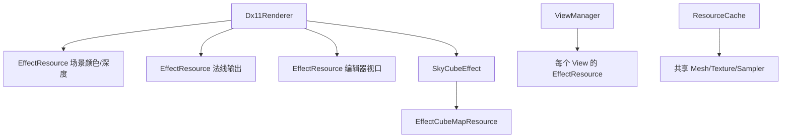

# Effect 资源与 View 管理

本文记录当前 DX11 框架中 Effect 私有资源、绘制入口和视图状态保护方式。

## 1. 设计目标

- 一个资源类只管理一种明确的 GPU 资源组合。
- 每个 Effect 通过显式成员持有自己的资源，不使用字符串资源注册表。
- 共享的模型纹理和 Sampler 仍由 `ResourceCache` 缓存。
- 将“绑定管线”和“发出绘制”区分开，为多个 Pass 留出位置。
- 在同一个 D3D11 Context 上切换视图后，可以通过 RAII 恢复调用者状态。

## 2. EffectResource

`EffectResource` 位于 `src/render/EffectResource.h/.cpp`，由原 `RenderTarget` 重命名而来。它表示一组
具体的二维离屏资源，而不是资源管理器：

```text
EffectResource
├── 颜色 Texture2D
├── RenderTargetView
├── ShaderResourceView
├── 深度 Texture2D
└── DepthStencilView
```

典型用法：

```cpp
class BlurEffect final : public IRenderEffect
{
  private:
    EffectResource m_horizontalResource;
    EffectResource m_verticalResource;
};

void BlurEffect::ResizeResources(std::uint32_t width, std::uint32_t height)
{
    m_horizontalResource.Resize(Device(), width, height);
    m_verticalResource.Resize(Device(), width, height);
}
```

资源名称直接体现在成员变量中，VS 调试器可以明确显示所有权和当前视图。`Resize` 在尺寸未变化时
不会重建资源；创建失败时保留旧资源，避免 Effect 进入部分更新状态。

## 3. EffectCubeMapResource

`EffectCubeMapResource` 管理一个 TextureCube：

```text
EffectCubeMapResource
├── Texture2D Array（6 个面）
├── TextureCube ShaderResourceView
├── 可选的整体 RenderTargetView
└── 可选的 6 个单面 RenderTargetView
```

静态天空盒只需要采样：

```cpp
m_cubeMapResource.LoadDDS(Device(), cubeMapPath);
```

动态环境捕获需要写入 Cubemap：

```cpp
m_cubeMapResource.Create(
    Device(),
    512,
    DXGI_FORMAT_R16G16B16A16_FLOAT,
    true,
    true);
```

整体 RTV 用于通过 `SV_RenderTargetArrayIndex` 一次选择多个数组层；单面 RTV 用于依次渲染六个方向。
当前只提供资源创建，逐面相机和反射探针调度属于后续动态 Cubemap Pass。

## 4. IRenderEffect 与资源所有权

`IRenderEffect` 只保存非拥有的 Device/Context 指针并提供 Shader 二进制加载入口，不再持有通用资源
注册表。设备和 Context 的生命周期由 Renderer 保证长于 Effect。



多 Pass Effect 需要几个中间目标，就显式声明几个 `EffectResource` 成员。只有资源数量确实需要在运行时
变化时，才改用 `std::vector<EffectResource>`；不要提前恢复字符串注册表。

## 5. Draw 与 Pass

`IRenderEffect::Bind(frame, draw)` 是低层管线绑定接口，`Draw(frame, draw)` 默认调用 `Bind`。派生类
可以覆盖 `Draw`，在内部发出 Mesh 绘制或组织多个 Pass。

`BasicMeshEffect` 按 Entity 绘制；`ColorProcessorEffect` 绘制全屏三角形；`SkyCubeEffect` 提供只接收
`EffectFrameContext` 的重载，每帧绘制一次，不需要伪造 Entity。天空背景位于不透明物体之后，使用最远
深度和只读深度状态，只填充尚未被场景占用的像素。

## 6. ViewManager 与状态恢复

`ViewManager` 保存逻辑 View 的尺寸、Camera、原生窗口句柄和 `EffectResource`。它由
`ViewManager::Initialize(device, context)` 初始化，通过 `ViewManager::Instance()` 访问，并在 Renderer
关闭时调用 `Shutdown()`。

`CaptureState()` 返回 `ViewStateGuard`，构造时保存、析构时恢复：

- VS、HS、DS、GS、PS、CS Shader；
- InputLayout 和 PrimitiveTopology；
- Rasterizer、Depth/Stencil、Blend 状态；
- RTV、DSV 和 Viewport。

```cpp
{
    auto guard = ViewManager::Instance().CaptureState();
    ViewManager::Instance().SetDepthMode(DepthMode::ReadOnly);
    effect.Draw(frame, draw);
}
```

`ViewManager` 还提供常用 Blend 状态和自定义 Blend 描述：

```cpp
ViewManager::Instance().SetBlendMode(BlendMode::Opaque);
ViewManager::Instance().SetBlendMode(BlendMode::AlphaBlend);
ViewManager::Instance().SetBlendMode(BlendMode::Additive);
ViewManager::Instance().SetBlendMode(BlendMode::Premultiplied);
```

需要多 RenderTarget 或特殊混合因子时，直接传入 `D3D11_BLEND_DESC`，并可设置 Blend Factor
和 Sample Mask：

```cpp
std::array<float, 4> blendFactor = {};
ViewManager::Instance().SetBlendState(description, blendFactor, 0xffffffffU);
```

Blend 状态和深度/模板状态一样，会被 `ViewStateGuard` 自动保存和恢复。

## 7. stdfx.h

`src/stdfx.h` 集中列出第一方 C++ 目标经常使用的标准库、Win32、DXGI、D3D11 和 WRL 头文件。CMake
通过 `target_precompile_headers` 为 Core、Assets、Persistence、主程序和测试分别生成预编译产物。

公共 `.h` 文件仍需显式包含自身声明所依赖的头文件。这样即使关闭 PCH、单独编译测试文件或未来拆出
RHI 模块，也不会依赖偶然的包含顺序；常用头文件的预编译集合则只需要在 `stdfx.h` 中统一维护。
