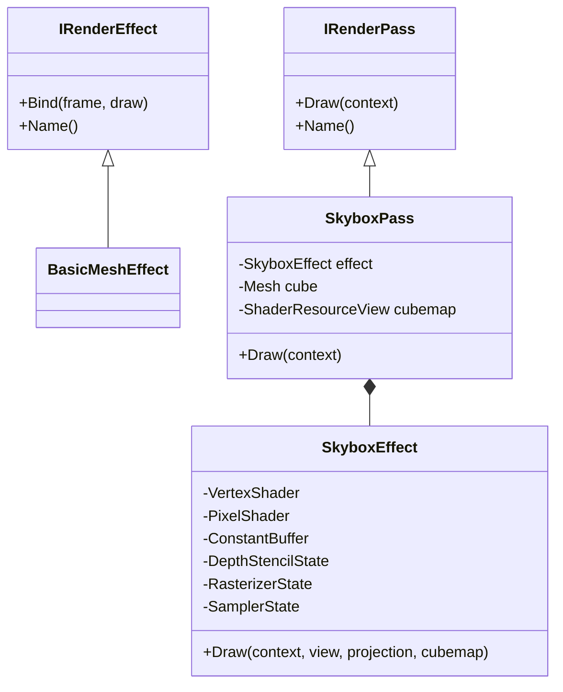
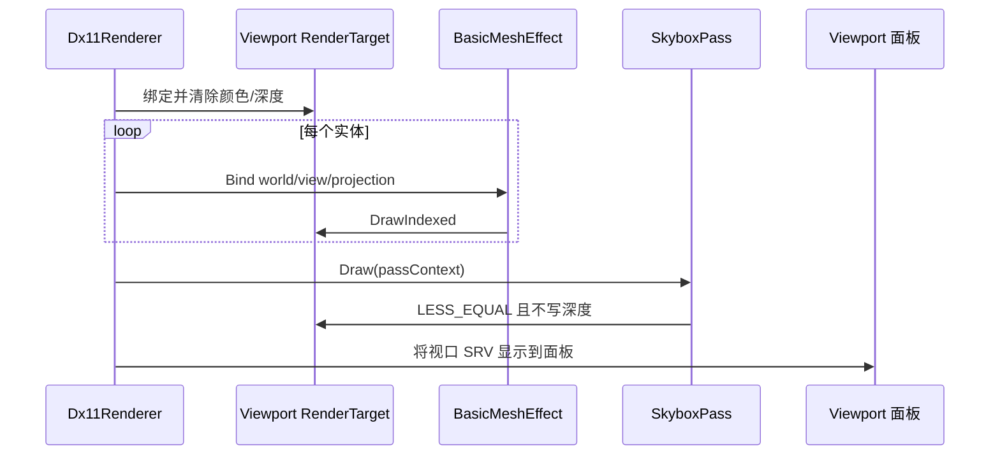
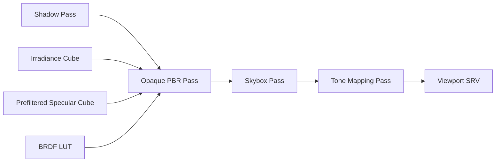

# 示例：为 LRenderDemo 添加天空盒 Pass

> 文档状态：长期 Pass 架构设计。当前工程已先以 `SkyCubeEffect + EffectCubeMapResource` 完成静态天空背景；本文后续内容描述将场景级效果继续拆成 `IRenderPass` 的演进方案。
>
> 当前基线：`main` 分支。实际代码位于 `src/render/SkyCubeEffect.*`、`src/render/EffectCubeMapResource.*` 和 `src/shaders/SkyVS/SkyPS.hlsl`。

## 1. 学习目标

完成本示例后，视口应显示一个跟随相机旋转、但不跟随相机平移的天空背景，并能在 Tools 面板中
启用或禁用。这个练习重点不是做完整的物理环境光照，而是学会：

1. 区分逐网格 Effect 和场景级 Render Pass。
2. 为 Pass 明确声明输入资源、输出目标和执行顺序。
3. 在 DX11 中加载 `TextureCube` DDS，并在 HLSL 中使用 `TextureCube.Sample`。
4. 正确设置天空盒的视图矩阵、深度状态、光栅化状态和资源解绑。
5. 将新功能接入 CMake、VS2022、编辑器控件和工程文档。

本示例第一阶段只实现“可见天空背景”。漫反射 IBL、镜面预过滤、BRDF LUT 和 HDR 色调映射属于
后续阶段，不能因为画出了天空就认为已经实现了环境光照。

## 2. 先给出结论

| 问题 | 本项目中的答案 |
|---|---|
| 天空盒继承哪个类？ | 新增 `IRenderPass`，然后让 `SkyboxPass final : public IRenderPass` |
| `SkyboxEffect` 是否继承 `IRenderEffect`？ | 不继承。它是 `SkyboxPass` 内部的管线状态封装 |
| 为什么不用 `IRenderEffect`？ | `IRenderEffect::Bind(frame, draw)` 要求逐网格的 Frame/Draw 快照，天空盒每帧只绘制一次，不属于任何实体 |
| 谁决定绘制顺序？ | `Dx11Renderer::RenderScene` |
| 天空盒放在什么时候画？ | 不透明物体之后，使用深度比较 `LESS_EQUAL`、关闭深度写入 |
| 谁拥有 DDS 和立方体网格？ | `SkyboxPass` |
| 谁拥有 shader、常量缓冲和固定状态？ | `SkyboxEffect` |
| 场景与命令模块是否修改？ | 不修改；天空盒是全局渲染设置，不是 `Scene` 实体 |

## 3. 为什么天空盒不是 `IRenderEffect`

当前接口位于 `src/render/IRenderEffect.h`：

```cpp
virtual void Bind(
    const EffectFrameContext& frame,
    const EffectDrawContext& draw) = 0;
```

这个签名明确描述了逐网格工作：

- `frame` 每帧从 Camera 和 D3D11 Context 构造一次；
- `draw` 从某个实体、解析后 Material 和编辑器选择状态构造；
- `Dx11Renderer` 在场景实体循环中调用一次 `Bind` 和一次 `Mesh::Draw`。

天空盒没有实体变换、选择颜色，也不应随实体数量重复绘制。如果强行继承 `IRenderEffect`，通常会
出现以下问题：

- 为了调用接口而伪造 Frame/Draw Context；
- 天空盒被错误地放进实体循环；
- Pass 顺序、目标 RTV/DSV 和资源依赖无法从接口看出来；
- 后续加入阴影、SSAO、SSR 时继续堆叠特殊判断。

因此保持两条边界：



`Pass` 表达“何时画、画到哪里、消费什么资源”；`Effect` 表达“一次 draw call 使用哪些 shader、
常量和固定管线状态”。

## 4. 示例素材

本示例使用 DirectXTKTest 的现成 cubemap：

| 项目 | 值 |
|---|---|
| 上游仓库 | `https://github.com/walbourn/directxtktest` |
| 固定提交 | `fabb928cf620381dfc188d52040a5a8e32bd1aec` |
| 上游路径 | `EffectsTest/cubemap.dds` |
| 本地路径 | `assets/skyboxes/downloads/directxtk-cubemap/cubemap.dds` |
| 许可 | MIT；原文保存在同目录 `SOURCE_LICENSE.txt` |
| DDS 尺寸 | 每面 `256×256` |
| cubemap 面 | `+X/-X/+Y/-Y/+Z/-Z` 六面齐全 |
| SHA-256 | `9a2156a1d20c9623cb2bac462e82f4c493c1907d998c4ae3315c0ce4ab64f65f` |

下载命令：

```powershell
powershell -ExecutionPolicy Bypass -File scripts/download-skybox-assets.ps1
```

选择 DDS 的原因是 DirectXTK 已提供 `CreateDDSTextureFromFile`，可以直接创建
`ID3D11ShaderResourceView`。第一阶段不需要引入 HDR 解码、全景图转六面图或离线纹理工具。

## 5. 目标目录结构

建议实现时新增以下文件：

```text
assets/
├── shaders/
│   └── Skybox.hlsl
└── skyboxes/
    ├── README.md
    └── downloads/directxtk-cubemap/cubemap.dds
src/render/
├── passes/
│   ├── IRenderPass.h
│   ├── SkyboxPass.h
│   └── SkyboxPass.cpp
└── effects/
    ├── SkyboxEffect.h
    └── SkyboxEffect.cpp
```

需要修改的现有文件：

| 文件 | 主要改动 | 预计风险 |
|---|---|---|
| `src/render/Dx11Renderer.h` | 持有 `SkyboxPass`，暴露有限的设置入口 | 中 |
| `src/render/Dx11Renderer.cpp` | 初始化、销毁、构造 PassContext、安排绘制顺序 | 中 |
| `src/render/RenderTarget.h` | 增加 RTV/DSV 的只读裸指针访问器 | 低 |
| `src/editor/EditorLayer.cpp` | 增加启用开关和可选旋转参数 | 低 |
| `src/CMakeLists.txt` | 加入新 `.cpp`，链接 `d3dcompiler` | 低 |
| `FILE_INDEX.md` | 登记新接口、Pass、Effect 和 shader | 低 |
| `CHANGELOG.md` | 记录行为与验证结果 | 低 |

明确不需要修改：

- `src/core/Scene.*`
- `src/core/Transform.h`
- `src/commands/`
- `src/render/IRenderEffect.h`
- `src/render/BasicMeshEffect.*`
- `src/app/Application.cpp`

## 6. 第一步：新增 Pass 接口

新建 `src/render/passes/IRenderPass.h`。第一版可以保留 DX11 类型，因为当前整个 render 模块本来
就是 DX11 后端。不要为了未来 RHI 先设计一套没有第二个后端验证的抽象。

```cpp
#pragma once

#include <SimpleMath.h>
#include <cstdint>
#include <d3d11.h>
#include <string_view>

namespace lrender {

struct RenderPassContext {
    ID3D11DeviceContext* deviceContext{};       // 非拥有指针
    ID3D11RenderTargetView* colorTarget{};      // 当前视口 RTV
    ID3D11DepthStencilView* depthTarget{};      // 当前视口 DSV
    DirectX::SimpleMath::Matrix view{};
    DirectX::SimpleMath::Matrix projection{};
    std::uint32_t viewportWidth{};
    std::uint32_t viewportHeight{};
};

class IRenderPass {
public:
    virtual ~IRenderPass() = default;
    virtual void Draw(const RenderPassContext& context) = 0;
    [[nodiscard]] virtual std::string_view Name() const noexcept = 0;
};

} // namespace lrender
```

这里的指针都不拥有资源。`Dx11Renderer` 和 `RenderTarget` 仍负责资源生命周期，Pass 只在
`Execute` 调用期间使用它们。

为什么 Context 中要显式带 RTV/DSV：

- 仅依赖“外部已经绑定”会形成隐藏状态；
- 将来加入多目标、阴影图或后处理时，Pass 输入输出会更容易审查；
- 调试时能验证目标是否为空、尺寸是否有效；
- 未来提取 RHI 时，可以从真实使用过的字段推导接口。

## 7. 第二步：为 RenderTarget 暴露非拥有视图

在 `src/render/RenderTarget.h` 添加：

```cpp
[[nodiscard]] ID3D11RenderTargetView* RenderTargetView() const noexcept {
    return m_renderTargetView.Get();
}

[[nodiscard]] ID3D11DepthStencilView* DepthStencilView() const noexcept {
    return m_depthStencilView.Get();
}
```

不要返回 `ComPtr`，否则调用方会误以为需要参与所有权管理。也不要让 Pass 访问
`m_colorTexture` 或 `m_depthTexture` 私有成员。

## 8. 第三步：编写 Skybox HLSL

新建 `assets/shaders/Skybox.hlsl`：

```hlsl
cbuffer SkyboxConstants : register(b0)
{
    float4x4 ViewProjection;
};

TextureCube SkyTexture : register(t0);
SamplerState SkySampler : register(s0);

struct VertexInput
{
    float3 position : SV_Position;
};

struct PixelInput
{
    float4 position : SV_Position;
    float3 direction : TEXCOORD0;
};

PixelInput VSMain(VertexInput input)
{
    PixelInput output;
    output.direction = input.position;

    float4 clipPosition = mul(float4(input.position, 1.0f), ViewProjection);
    output.position = clipPosition.xyww;
    return output;
}

float4 PSMain(PixelInput input) : SV_Target
{
    return SkyTexture.Sample(SkySampler, normalize(input.direction));
}
```

注意当前 `Mesh` 使用 DirectXTK `VertexPositionNormalColor`，它的位置语义是 `SV_Position`，不是
常见的 `POSITION`。Skybox 输入布局只需要读取第一个位置元素，但顶点 stride 仍由
`Mesh::Draw` 设为完整的 `sizeof(VertexPositionNormalColor)`。

### `xyww` 的含义

透视除法后深度为 `z / w`。将输出写成 `clipPosition.xyww`，会令 `z == w`，因此深度是 1，
也就是最远平面。配合 `LESS_EQUAL`：

- 清除后的背景深度是 1，天空盒通过；
- 已绘制物体深度小于 1，天空盒被挡住；
- 天空盒可以最后绘制，减少被物体遮挡区域的像素着色开销。

### 为什么移除相机平移

天空被认为距离无限远，应响应相机旋转，但不应因为相机位置变化而靠近某一面。CPU 更新常量前：

```cpp
auto viewWithoutTranslation = context.view;
viewWithoutTranslation._41 = 0.0F;
viewWithoutTranslation._42 = 0.0F;
viewWithoutTranslation._43 = 0.0F;

const auto viewProjection = viewWithoutTranslation * context.projection;
constants.viewProjection = viewProjection.Transpose();
```

这里执行 `Transpose()`，是因为 CPU 的 DirectXMath/SimpleMath 矩阵布局与 HLSL 默认矩阵读取约定
需要明确匹配。不要通过“看起来方向差不多”判断矩阵正确性，应检查旋转方向和六个面。

## 9. 第四步：实现 SkyboxEffect

`SkyboxEffect` 不继承 `IRenderEffect`。它只封装天空盒 draw call 需要的 GPU 管线资源：

```cpp
class SkyboxEffect final {
public:
    explicit SkyboxEffect(ID3D11Device* device);

    void Draw(
        ID3D11DeviceContext* context,
        const DirectX::SimpleMath::Matrix& view,
        const DirectX::SimpleMath::Matrix& projection,
        ID3D11ShaderResourceView* cubemap);

private:
    Microsoft::WRL::ComPtr<ID3D11VertexShader> m_vertexShader;
    Microsoft::WRL::ComPtr<ID3D11PixelShader> m_pixelShader;
    Microsoft::WRL::ComPtr<ID3D11InputLayout> m_inputLayout;
    Microsoft::WRL::ComPtr<ID3D11Buffer> m_constantBuffer;
    Microsoft::WRL::ComPtr<ID3D11SamplerState> m_samplerState;
    Microsoft::WRL::ComPtr<ID3D11DepthStencilState> m_depthState;
    Microsoft::WRL::ComPtr<ID3D11RasterizerState> m_rasterizerState;
};
```

构造函数应完成：

1. 使用 `D3DCompileFromFile` 编译 `VSMain` 和 `PSMain`，目标分别为 `vs_5_0`、`ps_5_0`。
2. 创建 vertex shader 和 pixel shader。
3. 从 VS bytecode 创建只有位置元素的 input layout。
4. 创建 16 字节对齐的动态或默认用法常量缓冲。
5. 创建线性采样、三轴 Clamp 的 sampler。
6. 创建 `DepthEnable=TRUE`、`DepthWriteMask=ZERO`、`DepthFunc=LESS_EQUAL` 的深度状态。
7. 创建 `CullMode=D3D11_CULL_FRONT` 的光栅化状态，因为相机在立方体内部。

深度状态核心配置：

```cpp
D3D11_DEPTH_STENCIL_DESC depthDescription{};
depthDescription.DepthEnable = TRUE;
depthDescription.DepthWriteMask = D3D11_DEPTH_WRITE_MASK_ZERO;
depthDescription.DepthFunc = D3D11_COMPARISON_LESS_EQUAL;
```

光栅化状态核心配置：

```cpp
D3D11_RASTERIZER_DESC rasterizerDescription{};
rasterizerDescription.FillMode = D3D11_FILL_SOLID;
rasterizerDescription.CullMode = D3D11_CULL_FRONT;
rasterizerDescription.DepthClipEnable = TRUE;
```

如果第一次实现完全看不到天空，可临时切换 `D3D11_CULL_NONE` 排查顶点绕序；确认后恢复正面剔除，
不要把关闭剔除当成最终修复。

`Draw` 必须显式设置本次 draw call 使用的状态：

```cpp
context->UpdateSubresource(m_constantBuffer.Get(), 0, nullptr, &constants, 0, 0);
context->IASetInputLayout(m_inputLayout.Get());
context->VSSetShader(m_vertexShader.Get(), nullptr, 0);
context->VSSetConstantBuffers(0, 1, m_constantBuffer.GetAddressOf());
context->PSSetShader(m_pixelShader.Get(), nullptr, 0);
context->PSSetShaderResources(0, 1, &cubemap);
context->PSSetSamplers(0, 1, m_samplerState.GetAddressOf());
context->OMSetDepthStencilState(m_depthState.Get(), 0);
context->RSSetState(m_rasterizerState.Get());
```

不要假设 `BasicMeshEffect` 留下的状态正好可用。DX11 immediate context 是状态机，每个 Effect 应绑定
自己依赖的全部关键状态。

### shader 编译错误处理

调用 `D3DCompileFromFile` 时同时接收 error blob。失败异常至少应包含：

- shader 文件相对路径；
- entry point；
- target profile；
- 编译器返回文本；
- HRESULT 十六进制值。

Debug 构建使用 `D3DCOMPILE_DEBUG | D3DCOMPILE_SKIP_OPTIMIZATION`；Release 使用
`D3DCOMPILE_OPTIMIZATION_LEVEL3`。`src/CMakeLists.txt` 需要链接 `d3dcompiler`。

## 10. 第五步：实现 SkyboxPass

`SkyboxPass` 是真正继承 `IRenderPass` 的类：

```cpp
class SkyboxPass final : public IRenderPass {
public:
    SkyboxPass(ID3D11Device* device, const std::filesystem::path& texturePath);

    void Draw(const RenderPassContext& context) override;
    [[nodiscard]] std::string_view Name() const noexcept override { return "Skybox"; }

    void SetEnabled(bool enabled) noexcept { m_enabled = enabled; }
    [[nodiscard]] bool IsEnabled() const noexcept { return m_enabled; }

private:
    SkyboxEffect m_effect;
    std::unique_ptr<Mesh> m_cubeMesh;
    Microsoft::WRL::ComPtr<ID3D11ShaderResourceView> m_cubemap;
    bool m_enabled{true};
};
```

构造函数职责：

1. 检查 `device` 和相对资源路径。
2. 用 `PrimitiveFactory::CreateCube(device)` 创建天空盒网格。
3. 用 DirectXTK `CreateDDSTextureFromFile` 加载 DDS。
4. 调用 `m_cubemap->GetDesc()`，确认 `ViewDimension == D3D11_SRV_DIMENSION_TEXTURECUBE`。
5. 失败时抛出包含文件路径和 HRESULT 的异常。

加载示意：

```cpp
Microsoft::WRL::ComPtr<ID3D11Resource> resource;
const HRESULT result = DirectX::CreateDDSTextureFromFile(
    device,
    texturePath.c_str(),
    resource.GetAddressOf(),
    m_cubemap.ReleaseAndGetAddressOf());
```

只保存 SRV 即可；SRV 会持有底层资源引用。局部 `resource` 用于创建后检查资源描述，离开构造函数后
释放自己的引用不会销毁仍被 SRV 引用的纹理。

`Execute` 负责：

1. `m_enabled == false` 时立即返回。
2. 验证 Context 中的 context、RTV、DSV 和 viewport 尺寸。
3. 显式绑定 Context 的 RTV/DSV。
4. 调用 `m_effect.Draw(...)`。
5. 调用 `m_cubeMesh->Draw(...)`。
6. 将 PS slot 0 的 SRV 解绑。
7. 恢复默认 depth/rasterizer state，避免状态泄漏到后续 ImGui 渲染。

资源解绑：

```cpp
ID3D11ShaderResourceView* nullResource = nullptr;
context.deviceContext->PSSetShaderResources(0, 1, &nullResource);
context.deviceContext->OMSetDepthStencilState(nullptr, 0);
context.deviceContext->RSSetState(nullptr);
```

严格来说，后续 Effect 也应完整绑定自己的状态，但 Pass 在边界处清理自己的 SRV 能避免未来同一
纹理被当作输出资源时出现读写冲突。

## 11. 第六步：接入 Dx11Renderer

在 `Dx11Renderer.h` 增加：

```cpp
std::unique_ptr<SkyboxPass> m_skyboxPass;

[[nodiscard]] SkyboxPass& Skybox() noexcept { return *m_skyboxPass; }
```

初始化时使用仓库相对路径，不得写开发机器的绝对路径：

```cpp
m_skyboxPass = std::make_unique<SkyboxPass>(
    m_device.Get(),
    std::filesystem::path{
        L"assets/skyboxes/downloads/directxtk-cubemap/cubemap.dds"});
```

VS 调试器工作目录已经由 CMake 设置为仓库根目录，所以 F5 和引导脚本都能解析这个相对路径。

`Shutdown` 中应在释放 D3D context/device 前调用：

```cpp
m_skyboxPass.reset();
```

在 `RenderScene` 中构造 Context，并在实体循环后执行：

```cpp
for (const Model& model : scene.Models()) {
    for (const Entity& entity : model.entities) {
        // 这里沿用 Dx11Renderer 当前的 Solid/Mesh 分支：Solid 选择程序化网格，
        // Mesh 通过 MeshGeometry 的资产路径和索引取得 MeshAssetEntity。
        DrawEntity(entity, view, projection);
    }
}

RenderPassContext passContext{
    .deviceContext = m_context.Get(),
    .colorTarget = m_viewportTarget.RenderTargetView(),
    .depthTarget = m_viewportTarget.DepthStencilView(),
    .view = view,
    .projection = projection,
    .viewportWidth = m_viewportTarget.GetWidth(),
    .viewportHeight = m_viewportTarget.GetHeight(),
};
m_skyboxPass->Draw(passContext);
```

推荐顺序：



## 12. 第七步：添加编辑器控制

最小控制只需要一个启用开关。在 `EditorLayer::DrawToolbar` 中：

```cpp
bool skyboxEnabled = renderer.Skybox().IsEnabled();
if (ImGui::Checkbox("Skybox", &skyboxEnabled)) {
    renderer.Skybox().SetEnabled(skyboxEnabled);
}
```

第二步可以增加 Y 轴旋转参数，帮助对齐环境方向：

```cpp
float rotationDegrees = renderer.Skybox().RotationDegrees();
if (ImGui::SliderFloat("Sky rotation", &rotationDegrees, -180.0F, 180.0F)) {
    renderer.Skybox().SetRotationDegrees(rotationDegrees);
}
```

旋转应进入 Skybox 常量或 view 矩阵组合，不要修改 DDS 文件。全局天空设置当前不进入 Scene，因此
第一版不接入 `CommandHistory`。如果以后需要保存场景和撤销环境设置，再引入独立
`EnvironmentSettings` 数据模型与命令。

当前 `EditorLayer.cpp` 约 256 行，新增控制后仍应检查 300 行约束。如果继续加入曝光、IBL 强度、
Mip 调试等控件，应抽出 `RenderSettingsPanel`，不要让 EditorLayer 无限增长。

## 13. 第八步：更新 CMake

在 `src/CMakeLists.txt` 的 `LRenderDemo` 源文件中加入：

```cmake
render/effects/SkyboxEffect.cpp
render/passes/SkyboxPass.cpp
```

链接运行时 shader 编译器：

```cmake
target_link_libraries(LRenderDemo PRIVATE
    LRenderCore
    imgui
    imguizmo
    d3d11
    d3dcompiler
    dxgi
    dxguid)
```

Skybox HLSL 应复用 `src/CMakeLists.txt` 中已经验证的基础网格 Shader 管线：通过
`set_source_files_properties` 登记 VS/PS 类型、入口点、Shader Model 和按配置隔离的 CSO 路径，
并加入 VS 的 `Shaders` 筛选器。`SkyboxEffect` 从构建目录加载 CSO，使编译错误在构建阶段暴露，
且修改 HLSL 后无需手工复制文件。

## 14. 完整帧状态说明

天空盒最后绘制依赖以下状态组合：

| 阶段 | 深度测试 | 深度写入 | 比较函数 | 剔除 | 资源 |
|---|---|---|---|---|---|
| Clear | - | 写入 1.0 | - | - | 清空 RTV/DSV |
| Opaque | 开 | 开 | LESS | 由 BasicMeshEffect 决定 | 普通网格 |
| Skybox | 开 | 关 | LESS_EQUAL | FRONT | TextureCube t0 |
| ImGui | 无视口 DSV | 关 | - | 由 ImGui 后端设置 | 采样视口 SRV |

不能使用 `DepthEnable=FALSE` 后最后绘制天空盒，否则它会覆盖前面所有物体。也不能保持深度写入，
否则后续透明物体或 Gizmo 合成可能得到错误深度。

## 15. 验证步骤

### 15.1 静态验证

1. `SkyboxPass` 继承 `IRenderPass`，不继承 `IRenderEffect`。
2. `SkyboxEffect` 不包含 Scene、Entity 或 Editor 依赖。
3. `RenderPassContext` 指针均为非拥有指针。
4. 所有新 COM 资源使用 `Microsoft::WRL::ComPtr`。
5. 资源路径是仓库相对路径，没有 `D:\...` 等机器路径。
6. `src/CMakeLists.txt` 包含新 `.cpp` 和 `d3dcompiler`。
7. 更新 `FILE_INDEX.md`、`CHANGELOG.md` 和必要的学习文档。

### 15.2 构建验证

```powershell
cmake --preset vs2022
cmake --build --preset vs2022-debug
ctest --preset vs2022-debug
```

### 15.3 运行时验证

1. 启动时 DDS 路径存在，SRV 维度为 `TEXTURECUBE`。
2. 相机环绕时天空方向变化自然。
3. 相机平移时天空没有视差。
4. 立方体和球体始终遮挡天空。
5. 关闭 Skybox 后恢复原清屏色。
6. 调整视口大小后天空没有拉伸、闪烁或黑边。
7. Wireframe 开关只影响场景网格，不影响天空盒。
8. D3D11 Debug Layer 没有 resource hazard、无效 state 或未解绑 SRV 警告。

### 15.4 图形调试验证

用 Visual Studio Graphics Diagnostics 或 PIX 捕获一帧，找到天空盒 draw call，检查：

- 一次 `DrawIndexed`，不是按实体数量重复；
- PS slot 0 的资源维度为 TextureCube；
- VS 常量中的 view 矩阵平移为 0；
- DepthFunc 是 `LESS_EQUAL`；
- DepthWriteMask 是 `ZERO`；
- 输出目标是 viewportTarget，不是交换链 back buffer；
- 天空盒之后 PS slot 0 已解绑。

## 16. 常见问题

### 16.1 整个视口是黑色

按以下顺序检查：

1. DDS 是否成功加载，SRV 是否是 `D3D11_SRV_DIMENSION_TEXTURECUBE`。
2. shader 编译错误文本是否被完整记录。
3. input layout 语义是否使用 `SV_Position`。
4. 临时改成 `D3D11_CULL_NONE`，排除绕序问题。
5. 检查 cubemap 是否绑定到 `t0`，sampler 是否绑定到 `s0`。
6. 检查 `SkyboxPass` 是否在清屏之后执行。

### 16.2 天空盒跟着相机位置移动

没有从 view 矩阵移除 `_41/_42/_43` 平移分量，或者错误地给天空盒使用了相机 world 变换。

### 16.3 天空覆盖了所有实体

常见原因是天空盒最后绘制但关闭了深度测试。应使用 `DepthEnable=TRUE`、`LESS_EQUAL` 和
`DepthWriteMask=ZERO`。

### 16.4 天空方向颠倒或左右镜像

依次检查：

1. HLSL 乘法顺序是否与 CPU 的矩阵转置策略一致；
2. cubemap 坐标方向是否被额外取负；
3. DX11 左手坐标和素材面方向是否匹配；
4. 只修正一次，不要同时在 CPU、VS 和纹理导入阶段各翻转一次。

### 16.5 物体边缘出现天空穿透

检查 projection 的远平面、深度格式和 `xyww` 输出。不要使用略小于 1 的手写深度偏移掩盖问题。

### 16.6 颜色过亮或过暗

当前示例是 LDR DDS，项目的视口目标也是 `R8G8B8A8_UNORM`，尚未形成完整的线性 HDR 管线。
不要在第一版随意添加 gamma 幂函数。后续应统一决定：

- 纹理是否按 sRGB 采样；
- 中间目标是否为浮点 HDR；
- tone mapping 在哪个 Pass 执行；
- 最终输出何时进行线性到 sRGB 转换。

## 17. 推荐的学习提交顺序

不要一次写完所有代码再调试。推荐分成以下小步骤：

1. `render: add render pass context`：只加 `IRenderPass` 和 RenderTarget 访问器，构建通过。
2. `render: add skybox shaders and effect`：编译 shader、创建状态，不接入帧循环。
3. `render: load cubemap skybox pass`：加载 DDS 并验证 TextureCube SRV。
4. `render: execute skybox after opaque scene`：接入 `Dx11Renderer`，先看到正确画面。
5. `editor: expose skybox controls`：增加启用和旋转控件。
6. `docs: record skybox pass validation`：更新索引、变更记录和调试截图。

每一步都运行 Debug 构建和 CTest。出现黑屏时，回退到最近一个“构建通过且职责单一”的步骤会比
同时排查资源、shader、状态和 UI 容易得多。

## 18. 后续扩展路线

完成 LDR 天空盒后，建议按以下顺序扩展：

1. 支持选择多个 cubemap DDS，并保存 `EnvironmentSettings`。
2. 增加 Y 轴旋转和调试 Mip 级别。
3. 将视口颜色目标升级为 `R16G16B16A16_FLOAT`。
4. 离线将等距柱状 HDR 转为 cubemap。
5. 生成漫反射 irradiance cubemap。
6. 生成按粗糙度预过滤的 specular cubemap Mip 链。
7. 生成或加载 BRDF integration LUT。
8. 让物体 PBR Effect 使用三项 IBL 资源。
9. 增加 tone-mapping Pass，再输出到 LDR 视口目标。

这时建议形成如下 Pass 图：



天空盒显示纹理和 PBR IBL 可以来自同一个 HDR 环境，但它们不是同一个 GPU 资源处理阶段。

## 19. RHI 边界说明

当前阶段允许 `IRenderPass` 和 `SkyboxEffect` 使用原生 D3D11 类型，因为项目只有一个后端。为了
降低未来迁移成本，保持以下边界：

- `core/`、`commands/`、`editor/` 不持有 D3D11 资源；
- 资源创建、shader 和 state 全部留在 `render/`；
- Editor 只调用 `SetEnabled`、`SetRotationDegrees` 等语义接口；
- 资源路径和环境设置不暴露 `ID3D11ShaderResourceView`；
- 第二个后端真正出现后，再从 `RenderPassContext` 的已验证字段提取 RHI 命令与资源视图。

不要现在创建 `IRHITexture`、`IRHICommandList` 等空泛接口。先让 DX11 天空盒完整工作并捕获一帧，
再以实际 API 调用为依据设计第二后端边界。

## 20. 完成定义

只有同时满足以下条件，天空盒功能才算完成：

- [ ] `SkyboxPass` 继承 `IRenderPass`，每帧只执行一次。
- [ ] `SkyboxEffect` 独立管理 shader、常量和固定状态。
- [ ] DDS 被验证为 TextureCube，而不是普通 2D 纹理。
- [ ] 相机旋转有效、相机平移无视差。
- [ ] 天空不覆盖场景实体，且不写入深度。
- [ ] 编辑器可以启用/禁用天空盒。
- [ ] 视口缩放和 Wireframe 模式无回归。
- [ ] Debug Layer 无警告。
- [ ] VS2022 Debug 构建和 CTest 通过。
- [ ] `FILE_INDEX.md`、`CHANGELOG.md` 和本示例的实际状态已更新。
