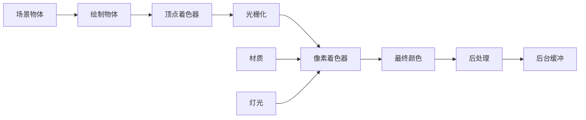
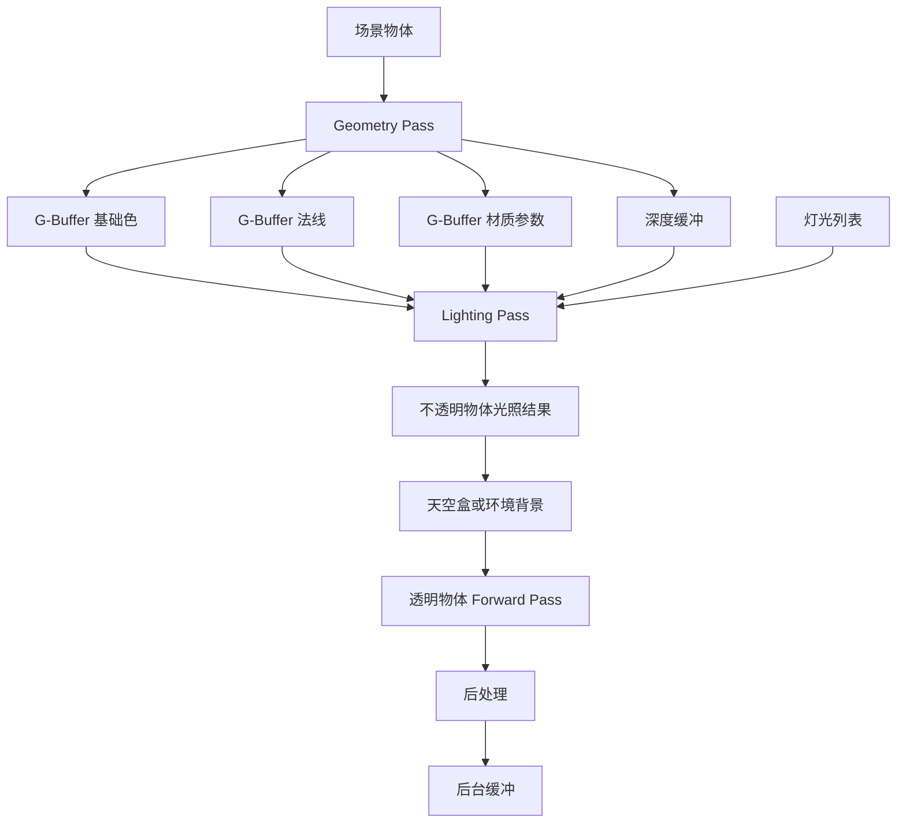

# 直接渲染与延迟渲染学习笔记

本文是一份独立的实时图形学学习笔记，不依赖任何具体引擎、项目目录或类名。示例使用接近 HLSL
的伪代码，便于在 DirectX 11、OpenGL、Vulkan 或自定义 RHI 中迁移理解。

本文讨论的“直接渲染”是 `Forward Rendering`，也常译为“前向渲染”；“延迟渲染”是
`Deferred Rendering`，也常译为“延迟着色”。这里比较的是光照计算的组织方式，不是即时渲染与离线
渲染器的区别。

## 1. 核心结论

直接渲染和延迟渲染都使用顶点着色器、光栅化、像素着色器、深度测试和 RenderTarget。最重要的区别
只有一个：光照是在几何绘制阶段完成，还是先保存表面信息，再在后续 Pass 中完成。

```text
直接渲染：
    几何 -> 像素着色器 -> 立即计算光照 -> 最终颜色

延迟渲染：
    几何 -> 写入 G-Buffer -> 独立光照 Pass -> 最终颜色
```

可以用一句话记忆：

```text
直接渲染是“得到片元就计算它的光照”；
延迟渲染是“先记录片元是什么，再决定它受到哪些灯光影响”。
```

两种方案没有绝对的优劣。选择取决于灯光数量、透明物体比例、材质差异、目标硬件、显存带宽和学习
目标。

## 2. 光栅化管线中的位置

一个典型的实时光栅化流程如下：

```text
顶点缓冲
  -> 输入装配
  -> 顶点着色器
  -> 图元装配
  -> 裁剪
  -> 光栅化
  -> 像素着色器
  -> 深度/模板测试
  -> 混合
  -> RenderTarget
```

顶点着色器通常负责将模型坐标转换到裁剪空间，并传递世界坐标、法线、UV 等插值数据。像素着色器
接收一个光栅化片元，然后决定该片元的颜色、透明度以及其他 RenderTarget 输出。

“直接”和“延迟”并不意味着跳过顶点着色器或光栅化。两者都必须先把三角形转换为屏幕片元，区别在于
像素阶段输出什么，以及之后是否还有一个独立光照阶段。

## 3. 直接渲染

### 3.1 定义

直接渲染在绘制不透明物体时就完成材质和灯光计算。一个简化的像素着色器如下：

```hlsl
float4 PixelMain(PixelInput input) : SV_TARGET
{
    float3 normal = normalize(input.worldNormal);
    float3 surfaceColor = SampleBaseColor(input.uv);
    float3 viewDirection = normalize(cameraPosition - input.worldPosition);

    float3 color = EvaluateAmbient(surfaceColor);
    color += EvaluateDirectionalLights(normal, viewDirection, surfaceColor);
    color += EvaluatePointLights(input.worldPosition, normal, viewDirection, surfaceColor);
    color += EvaluateSpotLights(input.worldPosition, normal, viewDirection, surfaceColor);

    return float4(saturate(color), SampleOpacity(input.uv));
}
```

这里的像素着色器输出已经接近最终显示颜色。后面仍然可以继续经过反射、色调映射、抗锯齿等后处理，
但核心光照已经在当前物体的绘制过程中完成。

### 3.2 一帧的典型流程



### 3.3 光照工作量

设屏幕上参与光栅化的片元数为 `P`，每个片元需要检查的灯光数为 `L`，最简单的估算是：

```text
光照计算量 ≈ P × L
```

这个估算不是精确的 GPU 性能公式，因为真实成本还会受到以下因素影响：

- 深度测试前后的过度绘制数量。
- 灯光是否被视锥、距离或灯光体积剔除。
- 阴影贴图采样次数。
- 材质分支和纹理采样次数。
- Shader 指令是否受到分支发散影响。
- GPU 的缓存命中率和并行度。

如果一个片元只会受到少量灯光影响，直接渲染的 `P × L` 可能非常合理；如果很多灯光都覆盖同一批
屏幕像素，重复计算就会成为瓶颈。

### 3.4 直接渲染的特点

- 每个材质可以使用不同的顶点和像素着色器。
- 材质参数、纹理和采样器可以直接参与当前物体的计算。
- 透明、半透明、粒子、植被和头发等效果更容易接入。
- 可以自然地使用前向 MSAA。
- 中间 RenderTarget 少，显存占用和带宽压力较低。
- 渲染路径通常容易单步调试，物体到最终颜色的调用关系清楚。

## 4. 延迟渲染

### 4.1 定义

延迟渲染至少包含两个主要阶段：

1. 几何阶段（Geometry Pass）：绘制物体，记录表面属性到 G-Buffer。
2. 光照阶段（Lighting Pass）：读取 G-Buffer，在屏幕空间计算最终颜色。

几何阶段不再计算完整灯光，而是保存后续光照所需的数据。一个简化的几何阶段像素着色器如下：

```hlsl
GBufferOutput GeometryPixelMain(GeometryPixelInput input)
{
    GBufferOutput output;
    output.albedo = SampleBaseColor(input.uv);
    output.normal = EncodeNormal(normalize(input.worldNormal));
    output.material = PackMaterialParameters();
    output.emissive = SampleEmissive(input.uv);
    return output;
}
```

之后使用全屏三角形或灯光体积执行光照：

```hlsl
float4 LightingPixelMain(FullscreenInput input) : SV_TARGET
{
    float3 albedo = GBufferAlbedo.Sample(pointSampler, input.uv).rgb;
    float3 normal = DecodeNormal(GBufferNormal.Sample(pointSampler, input.uv).rgb);
    float4 material = GBufferMaterial.Sample(pointSampler, input.uv);
    float depth = DepthTexture.Sample(pointSampler, input.uv).r;

    float3 worldPosition = ReconstructWorldPosition(input.uv, depth);
    float3 color = EvaluateAmbient(albedo);
    color += EvaluateAllLights(worldPosition, normal, albedo, material);

    return float4(color, 1.0F);
}
```

“延迟”表示光照延迟到几何阶段之后，并不表示延迟到下一帧，也不表示 CPU 等待 GPU。

### 4.2 一帧的典型流程



### 4.3 为什么延迟渲染可以减少重复光照

在经典延迟渲染中，几何阶段只为每个可见屏幕像素保留一份表面信息。光照阶段可以根据屏幕位置、
深度和灯光范围决定某盏灯是否影响该像素。

例如，一个点光源只覆盖屏幕上的一小块区域，光照 Pass 只需要处理这块区域，而不必让场景中每一个
物体的像素着色器都遍历该点光源。灯光越多、物体越集中、屏幕覆盖区域越重叠，延迟渲染越有机会节省
重复计算。

但“节省光照计算”并不是免费得到的。每个像素需要写入多个 G-Buffer，还要在光照阶段重新读取这些
数据，因此延迟渲染通常用更高的带宽和显存换取更稳定的多光源效率。

## 5. G-Buffer

### 5.1 G-Buffer 是什么

G-Buffer 是 Geometry Buffer 的简称，可以理解为“几何阶段输出的多个屏幕空间表面属性纹理”。它不是
某一种固定格式，而是一组由渲染器自行约定的 RenderTarget。

典型通道如下：

| 通道 | 常见内容 | 作用 |
|---|---|---|
| Albedo | 基础色、透明度或材质颜色 | 漫反射和材质恢复 |
| Normal | 世界空间或视图空间法线 | 漫反射、高光、SSAO、SSR |
| Material | 粗糙度、金属度、光泽度、AO 等 | 控制光照模型 |
| Emissive | 自发光颜色 | 不依赖灯光的发光结果 |
| Depth | 深度值 | 深度测试、位置重建、屏幕空间效果 |

不需要把所有数据都放进 G-Buffer。应根据光照模型和后续效果选择最小可用布局。

### 5.2 一个适合学习的最小布局

对于 Lambert 或 Blinn-Phong，可以先使用：

```text
GBuffer0: RGB = Albedo，A = 不透明度或保留
GBuffer1: RGB = 编码后的 Normal，A = 保留
GBuffer2: RGB = SpecularColor，A = Shininess 或参数索引
Depth:    深度缓冲
```

如果使用 PBR，可以改为：

```text
GBuffer0: RGB = BaseColor，A = 遮罩或不透明度
GBuffer1: RGB = Normal，A = 粗糙度
GBuffer2: R   = 金属度，G = AO，B = 自发光强度，A = 其他参数
Depth:    深度缓冲
```

格式并没有唯一答案。真正重要的是 C++ 侧的 RenderTarget 创建描述、几何 Shader 的写入布局和光照
Shader 的读取布局必须严格一致。

### 5.3 法线编码

法线通常在 `[-1, 1]` 范围，而普通 UNORM 颜色目标在 `[0, 1]` 范围，因此常见的简单编码是：

```hlsl
float3 EncodeNormal(float3 normal)
{
    return normal * 0.5F + 0.5F;
}

float3 DecodeNormal(float3 encoded)
{
    return normalize(encoded * 2.0F - 1.0F);
}
```

这种方法易于理解，但会浪费一部分精度。正式项目可以使用八面体编码（Octahedral Encoding）或更高
精度的浮点格式。学习阶段应优先保证编码和解码成对，再比较不同格式的误差。

### 5.4 深度是否要单独存成 SRV

光照阶段通常需要读取深度，因此深度资源需要同时具备：

- 深度/模板视图（DSV），供几何阶段深度测试使用。
- 着色器资源视图（SRV），供光照或后处理读取。

具体 API 对深度格式的支持不同。DirectX 11 中常见做法是使用可创建 SRV 的 typeless 深度纹理，再为
DSV 和 SRV 分别指定兼容的视图格式。资源创建时必须确认格式、绑定标志和视图格式匹配。

## 6. 世界坐标、视图坐标与屏幕坐标

直接渲染和延迟渲染都可以在世界空间或视图空间计算光照。只要法线、灯光位置、相机位置和片元位置处于
同一个坐标空间，光照公式本身不会因为换空间而改变。

### 6.1 世界空间

优点：

- 灯光和物体的位置通常天然以世界空间保存。
- 调试时更容易把坐标与场景中的实体对应起来。
- 阴影、反射探针和环境光等场景级数据更直观。

缺点：

- 超大场景中可能出现浮点精度问题。
- 延迟光照需要从深度重建世界坐标，矩阵和坐标约定必须正确。

### 6.2 视图空间

优点：

- 相机附近的坐标精度通常更好。
- 视线方向可以简化为从原点指向片元。
- 某些屏幕空间效果更容易表达。

缺点：

- 每帧需要将灯光位置和方向转换到视图空间。
- 调试灯光位置时不如世界空间直观。

### 6.3 深度重建位置

如果 G-Buffer 不单独保存世界位置，可以根据屏幕 UV、深度和逆视图投影矩阵重建：

```hlsl
float3 ReconstructWorldPosition(float2 uv, float depth)
{
    float2 ndc = uv * 2.0F - 1.0F;
    float4 clipPosition = float4(ndc, depth, 1.0F);
    float4 worldPosition = mul(clipPosition, inverseViewProjection);
    return worldPosition.xyz / max(worldPosition.w, 0.0001F);
}
```

这段代码只是示意。实际实现必须确认：

- 矩阵是行向量还是列向量约定。
- UV 原点位于左上还是左下。
- NDC 的深度范围是 `[0, 1]` 还是 `[-1, 1]`。
- 纹理坐标的 Y 是否需要翻转。
- 深度值是否经过反向 Z 或特殊投影处理。

位置重建错误通常会表现为点光衰减位置不对、阴影方向异常、SSAO 漂移或整个场景上下翻转。

## 7. 直接渲染与延迟渲染对比

| 比较项 | 直接渲染 | 延迟渲染 |
|---|---|---|
| 光照时机 | 几何绘制时立即计算 | 几何完成后单独计算 |
| 主要输出 | 最终颜色、深度 | 多个 G-Buffer、深度 |
| 多光源效率 | 可能重复遍历灯光 | 可按屏幕区域筛选灯光 |
| 材质自由度 | 高，Shader 可高度定制 | 需要统一输出 G-Buffer |
| 透明物体 | 直接支持 | 通常需要单独 Forward Pass |
| MSAA | 接入较直接 | 多个 G-Buffer 的采样和解析更复杂 |
| 显存占用 | 通常较低 | 通常较高 |
| 带宽压力 | 较低到中等 | 较高，需要写入和读取多个目标 |
| 深度/法线复用 | 需要额外准备 | G-Buffer 天然提供 |
| 屏幕空间效果 | 需要额外输入 | 更容易接入 SSAO、SSR 等 |
| 材质分支 | 物体之间容易不同 | 几何阶段要处理统一布局 |
| 调试方式 | 追踪物体 Shader | 可单独查看每个 G-Buffer 通道 |
| 透明、粒子和植被 | 路径自然 | 通常采用混合渲染 |
| 入门难度 | 低到中 | 中到高 |

## 8. 直接渲染的优点与缺点

### 8.1 优点

1. 概念直观。一个物体从顶点数据到最终颜色的路径短，适合学习基础管线。
2. 材质灵活。不同物体可以使用不同的纹理、采样器、光照模型和 Shader。
3. 透明支持自然。按深度排序后，可以直接使用混合状态绘制。
4. MSAA 处理简单。几何阶段直接产生多重采样颜色。
5. 中间资源少。显存占用、RenderTarget 切换和带宽压力相对较小。
6. 特殊材质容易插入。卡通、毛发、玻璃和程序化材质可以保留自己的路径。

### 8.2 缺点

1. 多光源时可能为同一批片元重复计算大量灯光。
2. 物体互相遮挡时，仍可能发生过度绘制和无效像素工作。
3. 屏幕空间效果需要额外准备深度、法线或颜色输入。
4. 灯光、阴影和材质分支增多后，像素 Shader 可能变得复杂。
5. 如果缺少灯光剔除，场景规模增长后性能波动明显。

直接渲染并不等于只能支持少量灯光。灯光体积、视锥剔除、距离剔除、Forward+ 和 Clustered Forward
都可以降低无效灯光计算。

## 9. 延迟渲染的优点与缺点

### 9.1 优点

1. 大量动态不透明灯光可以在屏幕空间集中处理。
2. 几何阶段只保存表面数据，不需要为每盏灯执行完整光照。
3. 深度、法线和材质数据集中，便于实现 SSAO、SSR、边缘检测和调试视图。
4. 方向光、点光和聚光灯可以分别设计专门的 Lighting Pass。
5. 可以直观地观察 Albedo、Normal、Depth、Material 和 Lighting 中间结果。
6. 几何和灯光的处理边界清晰，适合研究多 Pass 渲染架构。

### 9.2 缺点

1. 多个 G-Buffer 会增加显存占用和显存带宽。
2. G-Buffer 格式一旦固定，增加材质属性可能需要重新设计打包布局。
3. 透明物体通常不能只写入一份 G-Buffer，需要额外的前向路径。
4. MSAA 需要对多个 G-Buffer 进行多重采样或解析。
5. 光照阶段需要读取深度并重建位置，坐标和精度问题更容易暴露。
6. 移动设备或低带宽硬件可能无法承受多个高精度目标。
7. 材质差异很大时，统一 G-Buffer 可能浪费空间或限制表达能力。

延迟渲染不是自动更快。它是用 G-Buffer 的额外带宽，换取多光源场景中更可控的光照成本。

## 10. 如何选择

### 10.1 按场景特征选择

| 场景特征 | 推荐方案 | 主要原因 |
|---|---|---|
| 学习基础管线、模型少、灯光少 | 直接渲染 | 调试路径短，概念清晰 |
| 主要是不透明物体，动态灯光很多 | 延迟渲染 | 屏幕空间集中计算多光源 |
| 透明、粒子、植被或头发占比高 | 直接或混合渲染 | 透明通常需要前向路径 |
| 需要快速实现 SSAO、SSR、深度可视化 | 延迟渲染 | 深度和法线已经集中在 G-Buffer |
| 目标设备显存和带宽有限 | 直接或 Forward+ | 减少多目标写入 |
| 材质类型差异很大 | 直接或混合渲染 | 每种材质可以保留独立 Shader |
| 大量不透明灯光，同时存在透明物体 | 混合渲染 | 不透明 Deferred，透明 Forward |
| 需要传统前向 MSAA | 直接或 Forward+ | 多目标采样管理更简单 |

### 10.2 按学习目标选择

如果目标是学习渲染原理，推荐顺序如下：

1. 使用直接渲染完成颜色、UV、法线、深度、材质和基础灯光。
2. 将法线和材质参数额外输出到多个 RenderTarget。
3. 学习 RTV、SRV、DSV 的绑定关系和资源解绑规则。
4. 建立只支持不透明物体的最小 G-Buffer。
5. 用独立 Lighting Pass 复现原来的 Lambert 或 Blinn-Phong 结果。
6. 加入点光位置重建、聚光灯和灯光体积。
7. 保留透明物体的 Forward Pass，形成混合渲染。
8. 再进入 SSAO、SSR、阴影、TAA 和 Forward+ 等更复杂主题。

这样可以把“光照公式错误”和“G-Buffer 或资源状态错误”分开定位。

### 10.3 为什么通常保留两条路径

学习型或实验型渲染器最好保留直接和延迟两条可切换路径，原因是：

- 直接渲染可以作为颜色和光照结果的基准。
- 延迟渲染可以单独观察 G-Buffer 和 Lighting Pass。
- 同一个场景可以进行 A/B 对照。
- 透明和特殊材质可以继续使用更合适的前向路径。
- 后续研究 Forward+ 时，可以比较三种光照组织方式。

## 11. 混合渲染

实际引擎经常同时使用多种路径，而不是在全场景中强制采用一种方案。

常见安排是：

```text
不透明物体
  -> Deferred Geometry
  -> Deferred Lighting

天空盒
  -> Skybox Pass

透明物体、粒子、头发
  -> Forward Transparent Pass

最终颜色
  -> 后处理
```

这种结构的关键是定义清晰的绘制顺序：

1. 先清理颜色和深度。
2. 绘制不透明物体并建立深度。
3. 执行不透明物体的延迟光照。
4. 绘制天空盒或环境背景。
5. 按深度从后向前绘制透明物体。
6. 执行后处理和色调映射。

天空盒的具体先后可以因深度策略而不同。例如，可以先绘制天空再绘制几何，也可以最后用只读深度绘制
深度值为最远平面的天空。重点是状态和深度约定必须明确。

## 12. Forward+ 与 Clustered Forward

经典直接渲染会让每个片元遍历全局灯光，经典延迟渲染则把不透明表面写入 G-Buffer。两者之间还有
Forward+ 和 Clustered Forward。

### 12.1 Forward+

Forward+ 仍然在物体像素着色器中计算最终光照，但在此之前先把屏幕划分为二维 Tile，并为每个 Tile
生成可能影响它的灯光列表。

```text
灯光剔除
  -> 为每个 Tile 生成灯光索引
  -> 物体像素 Shader 查找当前 Tile 的灯光列表
  -> 计算前向材质和最终颜色
```

它兼具以下特点：

- 比朴素 Forward 少遍历无关灯光。
- 不需要完整 G-Buffer，因此更容易保留透明和复杂材质。
- 通常需要 Compute Shader 或高效的 CPU/GPU 灯光分桶。

### 12.2 Clustered Forward

Clustered Forward 将屏幕划分为三维 Cluster，通常同时考虑屏幕位置和深度范围。一个深度切片中的灯光
列表比二维 Tile 更精确，适合深度复杂、灯光数量多的场景。

### 12.3 与 Deferred 的关系

```text
Forward：
    几何 + 材质 + 灯光 -> 最终颜色

Forward+：
    灯光分桶 -> 几何 + 材质 + 局部灯光列表 -> 最终颜色

Deferred：
    几何 -> G-Buffer -> 屏幕空间灯光 -> 最终颜色
```

如果目标是学习基本 DX11 管线，应先掌握普通 Forward 和最小 Deferred，再研究 Forward+ 或
Clustered Forward。

## 13. 延迟渲染的通用实现步骤

下面是一条不依赖具体工程类名的实现路线。

### 第一步：定义渲染数据协议

先确定每个 G-Buffer 通道的格式、颜色空间、坐标空间和字段含义：

```text
GBuffer0: Albedo
GBuffer1: Normal
GBuffer2: Material Parameters
Depth:    Depth + optional Stencil
```

同时记录：

- 是否使用 sRGB。
- 法线是世界空间还是视图空间。
- 深度是否反向 Z。
- 透明度是否进入 G-Buffer。
- 材质参数的精度要求。
- 是否需要自发光、AO、清漆或次表面参数。

### 第二步：创建共享深度和多个颜色目标

几何阶段应让所有颜色目标共享同一个深度缓冲。不要为每个 G-Buffer 通道各自创建一份深度，否则会
浪费显存，也无法保证它们的深度结果一致。

资源管理器至少应能完成：

- 按尺寸重建全部颜色纹理。
- 创建每个颜色纹理的 RTV 和 SRV。
- 创建共享深度纹理的 DSV 和可选 SRV。
- 绑定多个 RTV 与共享 DSV。
- 按通道清理和读取。
- 在 RTV 与 SRV 角色切换前解除冲突绑定。

### 第三步：编写 Geometry Pass

Geometry Pass 的职责是：

- 绘制不透明物体。
- 写入 Albedo、Normal 和 Material。
- 更新深度缓冲。
- 不执行完整的方向光、点光或聚光灯计算。

它仍然需要处理：

- 顶点变换。
- 法线变换。
- UV 和纹理采样。
- 材质分支。
- 双面和背面剔除。
- Alpha Test 等会影响几何可见性的操作。

### 第四步：编写 Lighting Pass

Lighting Pass 一般使用全屏三角形，也可以使用点光或聚光灯体积。

全屏三角形路径需要：

- 读取 G-Buffer SRV。
- 读取深度 SRV。
- 读取灯光常量或灯光列表。
- 重建世界位置或视图位置。
- 解码法线和材质参数。
- 输出最终不透明颜色。

方向光通常适合全屏三角形。点光和聚光灯可以使用包围球、圆锥体或其他灯光体积，仅处理受影响的像素，
从而减少无效计算。

### 第五步：恢复天空盒和透明路径

延迟渲染通常只覆盖不透明物体。天空盒、透明物体、粒子、植被和特殊材质需要单独安排：

- 天空盒可以独立绘制。
- 透明物体通常读取已经完成的场景颜色并使用 Forward 光照。
- Alpha Test 物体如果能明确丢弃片元，可以放入 Geometry Pass。
- 需要多层透明的效果可能需要 OIT、深度剥离或其他专门技术。

### 第六步：接入后处理

后处理通常放在最终不透明和透明颜色之后，包括：

- 色调映射。
- Gamma 或颜色空间转换。
- Bloom。
- FXAA、TAA 或其他抗锯齿。
- 颜色分级。
- 调试通道显示。

SSAO、SSR 等效果可以在 Lighting 前后插入，具体取决于它们需要的是原始 G-Buffer 还是已经完成光照的
颜色。

## 14. API 无关的伪代码

### 14.1 Forward

```cpp
BeginFrame();
BindSceneColorTarget();
ClearColorAndDepth();

for (const RenderItem& item : opaqueItems)
{
    BindMaterial(item.material);
    BindLights(frameLights);
    BindObjectTransform(item.transform);
    DrawMesh(item.mesh);
}

DrawSkybox();
DrawTransparentItemsBackToFront();
RunPostProcess();
Present();
```

### 14.2 Deferred

```cpp
BeginFrame();

BindGBufferTargetsAndSharedDepth();
ClearGBufferAndDepth();

for (const RenderItem& item : opaqueItems)
{
    BindGeometryMaterial(item.material);
    BindObjectTransform(item.transform);
    DrawMesh(item.mesh);
}

UnbindGBufferRenderTargets();
BindGBufferAsShaderResources();
BindSceneColorTarget();
DrawFullscreenLighting();

DrawSkybox();
DrawTransparentItemsForward();
RunPostProcess();
Present();
```

实际 API 中要特别处理资源冲突：同一张纹理不能在同一时刻既作为 RTV 写入，又作为 PS SRV 读取。
DX11 通常需要显式解除旧的 RTV、DSV 或 SRV 绑定。

## 15. 透明物体为什么通常继续使用 Forward

不透明 G-Buffer 通常假设一个屏幕像素最终只保留一个可见表面。透明场景中的同一个像素可能存在多个
深度层：

```text
背景
  -> 玻璃后表面
  -> 玻璃前表面
  -> 烟雾
```

单份 G-Buffer 无法同时保存任意数量的透明层以及它们的合成顺序。因此常见方案是：

- 不透明物体走 Deferred。
- 透明物体按深度从后向前走 Forward。
- 对复杂透明效果再使用 OIT、深度剥离或每像素链表。

这不是延迟渲染的缺陷，而是透明合成本身需要表达多层覆盖关系。

## 16. MSAA 与延迟渲染

直接渲染中，MSAA 可以在几何阶段直接对颜色和深度进行多重采样。延迟渲染需要考虑：

- 每个 G-Buffer 是否都使用多重采样。
- Lighting Pass 读取的是每个样本还是解析后的值。
- 法线和材质参数如何解析。
- 深度边缘是否需要样本级处理。
- 后处理是否接受多重采样纹理。

因此延迟渲染常见的学习顺序是：

1. 先使用单采样 G-Buffer 验证逻辑。
2. 再加入 MSAA 或其他抗锯齿方式。
3. 单独比较 G-Buffer 解析前后的边缘质量。

## 17. 显存和带宽估算

假设渲染分辨率为 `1920 × 1080`，每个像素写入：

- Albedo：4 字节。
- Normal：8 字节。
- Material：4 字节。
- 深度：4 字节。

则单份 G-Buffer 和深度的理论大小约为：

```text
1920 × 1080 × (4 + 8 + 4 + 4)
≈ 39.6 MiB
```

这还没有计算：

- 双缓冲或多帧资源。
- 后处理 Ping-Pong 目标。
- 阴影贴图。
- MSAA 倍数。
- 驱动和对齐开销。
- Lighting Pass 对这些资源的再次读取。

因此格式设计不能只看“能不能存下数据”，还要考虑带宽、缓存、精度和目标硬件。

## 18. 常见误区

### 误区一：有多个 RenderTarget 就是延迟渲染

不对。多个 RenderTarget 只是图形 API 提供的能力。只有后续独立阶段读取表面数据并完成光照，才构成
完整的 Deferred Lighting。

### 误区二：跳过光照就是延迟渲染

不对。Geometry Pass 可以暂时不计算光照，但如果没有 G-Buffer 读取和独立 Lighting Pass，最终只会得到
没有灯光的颜色。

### 误区三：延迟渲染一定更快

不对。延迟渲染用更多目标写入和读取换取多光源效率。在灯光少、分辨率高、透明很多或带宽有限时，
直接渲染可能更快。

### 误区四：延迟渲染只能使用全屏三角形

不对。全屏三角形适合方向光或统一屏幕处理，点光和聚光灯也可以使用灯光体积，只处理受影响的屏幕
区域。

### 误区五：透明物体必须写进 G-Buffer

通常不需要。常见混合结构是不透明物体 Deferred，透明物体 Forward。

### 误区六：世界空间一定比视图空间好

没有绝对答案。世界空间更直观，视图空间更适合相机附近的数值计算。最重要的是所有相关输入使用
同一个空间。

### 误区七：深度纹理可以直接当世界坐标

不可以。深度只提供投影空间中的一个分量，通常还需要屏幕 UV 和逆投影矩阵才能重建位置。

### 误区八：开启一个 Deferred 枚举就完成延迟渲染

不可以。至少还需要 G-Buffer、Geometry Pass、Lighting Pass、资源解绑、状态切换和透明路径。

## 19. 调试清单

当直接渲染和延迟渲染结果不一致时，建议按以下顺序检查：

1. Albedo 是否来自同一张纹理或同一个材质颜色。
2. 法线是否归一化。
3. 法线编码和解码是否互为逆操作。
4. 世界矩阵与法线逆转置矩阵是否正确。
5. G-Buffer 的格式和 Shader 声明是否完全匹配。
6. sRGB 读取和写入是否一致。
7. 深度是否被正确清理。
8. 深度比较方向是否与投影约定一致。
9. 逆视图投影矩阵是否与当前相机匹配。
10. NDC、UV 和深度范围是否处理正确。
11. 灯光、相机和片元是否处于同一坐标空间。
12. 点光范围、强度和衰减公式是否与直接路径一致。
13. G-Buffer 作为 SRV 读取前是否解除 RTV 绑定。
14. Lighting Pass 的输出目标是否已经正确绑定。
15. 深度、模板、混合和光栅化状态是否在 Pass 之间恢复。
16. 透明物体是否错误地进入不透明 Deferred 路径。
17. 后处理是否重复执行了 Gamma、曝光或色调映射。

建议最初只使用一个球、一个方向光和一个点光，关闭纹理、透明和高光，然后逐项打开功能。

## 20. 推荐学习路线

可以按以下顺序建立完整的理解：

```text
顶点变换
  -> 深度测试
  -> UV 与纹理采样
  -> 法线与 Lambert 光照
  -> Blinn-Phong 或简单 PBR
  -> 直接多光源
  -> 多 RenderTarget
  -> G-Buffer
  -> 延迟方向光
  -> 延迟点光和位置重建
  -> 天空盒与透明混合
  -> 阴影
  -> SSAO / SSR
  -> Forward+
  -> Clustered Forward
```

每个阶段都建议加入调试显示：

- 基础色。
- 法线。
- 深度。
- 材质参数。
- 灯光影响。
- 最终光照。

只看最终画面很难判断问题来自顶点变换、资源格式、光照公式还是状态泄漏。

## 21. 最终选择建议

如果正在学习 DirectX 11，建议先用直接渲染建立可验证的基准，再实现最小不透明延迟渲染。两条路径
都保留，并使用同一套场景、相机、材质和灯光进行对照。

可以将选择概括为：

```text
灯光少、材质复杂、透明多、追求简单：
    直接渲染

不透明物体多、动态灯光多、需要屏幕空间效果：
    延迟渲染

既要大量灯光，又要复杂材质和透明：
    混合渲染或 Forward+
```

学习阶段最有价值的不是证明哪种方案“更先进”，而是理解它们分别把计算、数据和复杂度放在了哪里：

- 直接渲染把复杂度放在物体 Shader 和材质路径中。
- 延迟渲染把复杂度放在 G-Buffer、资源带宽和 Pass 调度中。
- Forward+ 把复杂度放在灯光剔除和灯光列表管理中。

理解这三个位置，后续学习阴影、后处理、RHI 或更复杂的渲染架构时，才能做出有依据的设计选择。
