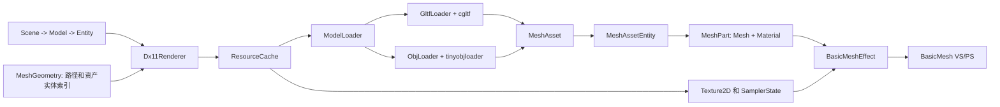

# 场景模型、网格导入、材质与多光源学习指南

本文说明本阶段新增能力如何协作，以及继续扩展法线贴图或 PBR 时应修改哪些边界。它描述的是
当前产品代码，不把规划中的能力计为已经实现。

## 1. 一帧中的数据流

- `Scene` 管理 `Model`，`Model` 管理可混合的 Solid/Mesh `Entity`；它们不持有 DX11 对象。
- Solid Entity 保存 Cube/Sphere/Plane 类型；Mesh Entity 保存资产路径和 `assetEntityIndex`。
- `ResourceCache` 用规范化且忽略大小写的路径缓存网格资产和外部纹理，用稳定键缓存 GLB 内嵌纹理。
- `ModelLoader` 按扩展名把文件交给 `GltfLoader` 或 `ObjLoader`。两者统一输出 `MeshAsset`。
- glTF Mesh Node 或 OBJ Shape 形成 `MeshAssetEntity`；其 primitive 或材质分组形成 `MeshPart`。
- `EntityMaterial` 保存实体可编辑参数；渲染层 `Material` 保存 BaseColor 因子、纹理、Sampler 和 GPU
  绘制参数。渲染器逐部件复制源材质后应用实体参数，不修改缓存。
- `BasicMeshEffect` 绑定矩阵、材质、方向光和点光；HLSL 完成纹理采样和光照。

## 2. 使用方式

1. 运行 `scripts/download-test-scenes.ps1` 准备学习素材。
2. 构建并启动 `LRenderDemo`。
3. 使用 `Create > Import Mesh...` 打开 Windows 原生文件选择器，选择 `.gltf`、`.glb` 或 `.obj`。
4. 在层级面板展开 Model 并选择 Entity，使用 Gizmo 或检查器调整变换。
5. 在 `Inspector > Material` 修改材质，或选择/恢复 BaseColor 贴图并切换显示模式。
6. 在 `Lighting` 面板调整环境光、一盏方向光和四盏点光。
7. 观察 `Resources` 面板；重复选择同一路径时，缓存数量不应增加。

导入会先完整加载网格资产。成功后，一个文件创建一个场景 Model，文件内各 Mesh Node/Shape 创建
对应的 Mesh Entity。同一个 Model 还可以继续添加 Cube、Sphere 或 Plane，渲染器会混合绘制。
失败时不会创建半成品 Model，而是在弹窗和 `logs/` 中给出上下文。整个导入操作可撤销/重做；
重做保留原始资源路径并复用缓存。

## 3. 当前支持范围

| 能力 | 状态 | 说明 |
|---|---|---|
| Scene/Model/Entity 层级 | 支持 | Model 可同时包含 Solid Entity 和 Mesh Entity；Entity ID 全局唯一 |
| `.gltf` 外部 Buffer/图片 | 支持 | URI 相对模型目录解析，图片由 WIC/DDS loader 创建 SRV |
| `.glb` BufferView 内嵌图片 | 支持 | 直接从内存创建纹理，不落地临时文件 |
| OBJ 与 MTL | 支持 | 多 Shape、多材质；读取 `Kd`、`Ks`、`Ns`、透明度和 `map_Kd` |
| 静态三角形 primitive | 支持 | 每个 primitive/材质分组形成独立 MeshPart，使用 32 位索引 |
| Position、Normal、UV | 支持 | glTF/OBJ 缺失法线时按三角面累计重建；glTF 支持材质指定的 UV 集索引 |
| glTF 节点变换 | 支持 | 烘焙世界变换，并统一完成右手系到左手系转换 |
| OBJ 坐标与 UV 转换 | 支持 | 翻转 Z、反转三角绕序，并翻转 UV 的 V 方向 |
| BaseColor 与 Sampler | 支持 | BaseColor 因子、sRGB 纹理、Wrap/Clamp/Mirror 和点/线性过滤 |
| 实体材质编辑 | 支持 | 漫反射、高光、双面、三种显示模式和完整撤销/重做 |
| 多光源 | 支持 | 一盏方向光、最多四盏点光、Lambert 与 Blinn-Phong |
| data URI 图片 | 暂不支持 | 当前只支持外部图片或 GLB BufferView 图片 |
| 蒙皮、动画、Morph | 暂不支持 | 当前模型是静态网格 |
| 法线/金属粗糙度/AO/自发光纹理 | 暂不支持 | 只读取 BaseColor；金属度/粗糙度仅近似映射到高光参数 |
| Alpha Blend/Mask | 暂不支持 | Alpha 值可进入 Shader，但尚无透明排序和 BlendState 管线 |
| KHR_texture_transform、Draco | 暂不支持 | 尚未处理扩展或压缩几何 |
| FBX 等 Assimp 格式 | 暂不支持 | 已预留 `IModelImporter`；后续新增 AssimpImporter 并注册扩展名 |
| OBJ 高级 MTL/PBR | 暂不支持 | bump、normal、reflection、PBR 扩展和完整透明管线尚未接入 |

## 4. 关键实现细节

### UV 与纹理

`MeshVertex` 的布局是 Position、Normal、TexCoord。`PrimitiveFactory` 为立方体逐面生成 UV，为球体
按经纬度生成 UV；`BasicMeshVS.hlsl` 原样传递 UV，`BasicMeshPS.hlsl` 从 `t0/s0` 采样。
程序化几何默认使用运行时生成的 2x2 棋盘纹理，因此不依赖本地图片也能验证 UV。

WIC 图片按 sRGB 创建并自动生成 mipmap；DDS 走 DirectXTK DDS loader。纹理和 Sampler 都由 RAII
对象持有，COM 所有权使用 `ComPtr`。

### 坐标系

glTF 使用右手坐标系和列主序矩阵；项目使用 DirectX 行向量形式。`cgltf` 的列主序 16 值数组按
原顺序写入 `SimpleMath::Matrix` 后，平移位于 DirectX 所需的第四行，语义上完成了矩阵约定转换；
不应再显式交换行列。随后把变换烘焙到顶点，翻转 Position/Normal 的 Z，并交换每个三角形的第二、
第三个索引。坐标转换只发生一次，场景变换和 Shader 不需要知道模型来源。

OBJ 没有节点矩阵；导入器直接翻转 Position/Normal 的 Z 并反转三角形绕序。OBJ 常见纹理坐标原点
与 DirectX 图片读取约定不同，因此导入时同时执行 `V = 1 - V`。两条格式路径都复用
`MeshImportUtils` 的缺失法线重建和网格创建逻辑。

### 后续接入 Assimp

新增 `AssimpImporter final : public IModelImporter`，在 `SupportsExtension()` 中声明 `.fbx` 等由其负责
的格式，并在 `ModelLoader` 构造函数中注册。导入结果仍转换为 `MeshAsset -> MeshAssetEntity ->
MeshPart`。这样不需要修改 `Scene`、`CreateModelCommand`、编辑器文件选择后的建模逻辑、
`ResourceCache::LoadMeshAsset()` 或 `Dx11Renderer` 的绘制分支。Assimp 只承担新格式解析；现有 glTF
和 OBJ 导入器继续保留，便于学习其坐标、材质和索引转换过程。

### 多光源常量缓冲

C++ 的 `BasicMeshConstants` 与 HLSL `BasicMeshConstants.hlsli` 中的同名 `cbuffer` 保持字段顺序和
16 字节对齐。GPU 缓冲由 `Dx11ConstantBuffer<BasicMeshConstants>` 管理。每盏点光占
两个 `float4`：位置/范围和颜色/强度。禁用点光时把强度写为零；像素 Shader 用距离与范围计算
平滑衰减。方向为零时 CPU 使用向下方向回退，避免 Shader 中出现无效归一化。

## 5. 推荐的下一步

法线贴图是最合适的下一阶段：给顶点增加 Tangent，在导入器中读取或重建切线，在 `Material` 中
增加 normal texture，再扩展 `BasicMeshEffect` 的 SRV 槽位和 HLSL TBN。先用 Damaged Helmet 验证
切线空间和纹理色彩空间，再实现真正的 Metallic-Roughness PBR；此时可直接复用现有模型、纹理、
Sampler 和缓存边界。
