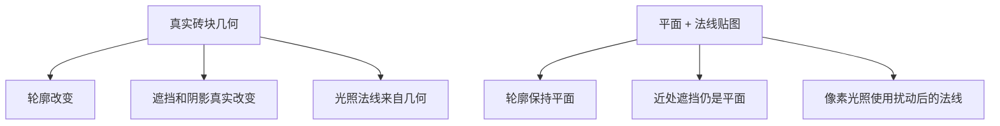
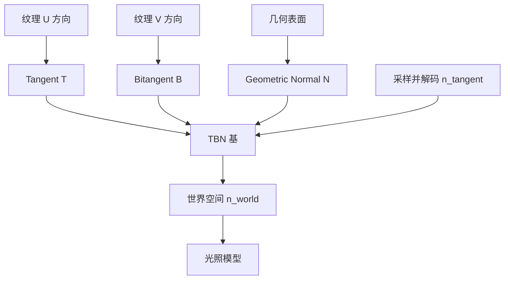
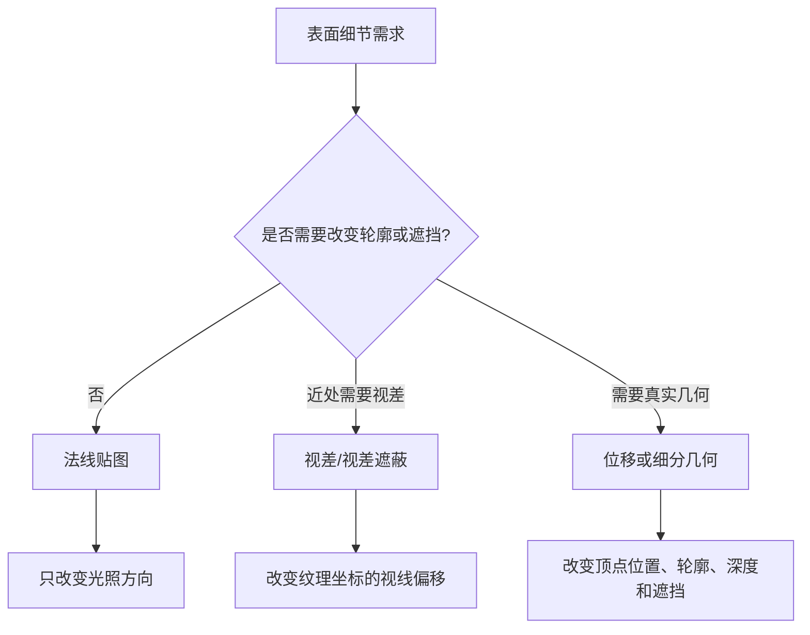

# 法线贴图：把细节搬到光照计算里

## 这章要解决什么

一块只有两个三角形的平面，为什么可以看起来像刻满砖缝的墙？为什么同一张法线贴图在一个模型上正常，在另一个模型上却出现绿色通道翻转、接缝、发黑或高光方向错误？

法线贴图（Normal Mapping）解决的是一个很具体的问题：**几何体太贵，表面细节又必须影响光照**。它不真的增加轮廓几何，而是为每个像素提供一个更细的表面法线，让光照模型在这个法线方向上计算。

本章的目标不是记住“采样一张紫色纹理”，而是建立一条可以自己推导和排错的链：

```text
纹理中的 RGB
    ↓ 解码为切线空间法线
Tangent / Bitangent / Normal
    ↓ 组成 TBN 基
世界空间表面法线
    ↓ 进入漫反射、高光、阴影和屏幕空间效果
像素颜色
```

完成后，你应该能解释、实现并调试：

- 法线贴图改变了什么，哪些东西没有改变；
- 为什么需要切线空间（Tangent Space）；
- T、B、N 如何组成 TBN，为什么 `B = cross(N, T)` 有时还不够；
- RGB 如何从 `[0, 1]` 解码到 `[-1, 1]`；
- 为什么 BaseColor 常按 sRGB 读取，而 Normal 常按 Linear 读取；
- 为什么镜像 UV、绿色通道、压缩格式和 mipmap 会制造看似“玄学”的错误；
- 法线贴图什么时候应该让位给真实几何、视差或位移。

## 先看一个现象

设想两块墙：左边由真正凸起的砖块建成，右边只是一个平面，但平面使用了砖块法线贴图。



这张图应该看“法线贴图到底改变哪一层”。它改变的是 `D` 和 `H` 所在的光照输入，通常不改变轮廓、深度、真实遮挡和碰撞形状。因此远处看砖墙时它很划算，贴近轮廓看或观察投射阴影时，它会暴露局限。

## 先建立直觉：每个像素都有一块小坐标纸

模型的世界空间像一张城市地图，法线贴图更像每个表面像素手里拿着的一张“小坐标纸”：

- `T`（Tangent，切线）沿着纹理 U 方向；
- `B`（Bitangent，副切线，也叫副切向）沿着纹理 V 方向；
- `N`（Normal，法线）垂直于表面。

法线贴图里的 `(0.5, 0.5, 1.0)` 表示“不要偏离原来的表面法线”。如果蓝色很高，说明向量主要朝切线空间的 `+Z`；红色和绿色把它向 `T` 或 `B` 方向倾斜。

```text
切线空间（每个像素自己的小坐标系）

                 +Z = N
                  ↑
                  │
                  └────→ +X = T
                 /
                /
             +Y = B
```

这个比喻有边界：坐标纸不是贴在屏幕上，而是贴在模型表面；每个三角形、甚至每个顶点附近的 T/B/N 都可能不同。真正的计算是把切线空间向量线性组合到目标空间。

## 正式定义：它是一张“法线方向纹理”

普通纹理回答“这里是什么颜色”，法线贴图回答“这里的表面朝哪个方向”。它通常把单位向量的三个分量编码到 RGB：

```text
n_tangent = normalize(2 * sample.rgb - 1)
```

其中：

- `sample.rgb` 是纹理采样结果，通常在 `[0, 1]`；
- `n_tangent` 是切线空间中的单位法线，分量在 `[-1, 1]`；
- `normalize` 用于修正过滤、压缩和数值误差带来的长度偏差。

再用 TBN 基变换：

```text
n_world = normalize(
    n_tangent.x * T_world +
    n_tangent.y * B_world +
    n_tangent.z * N_world)
```

按 LRenderDemo 的 Shader 契约，顶点变换使用行向量形式 `mul(vector, matrix)`。上面的向量组合与矩阵写法表达的是同一件事：把切线空间的坐标分量投影到世界空间基向量上。不要把“行主序”误当成“行向量”；它们分别描述内存布局和计算习惯。

## 数字例子：紫色为什么是平面法线

假设采样得到：

```text
RGB = (0.5, 0.5, 1.0)
```

解码后：

```text
2 * RGB - 1 = (0, 0, 1)
```

这正是切线空间的 `+Z`，所以它不会改变原来的几何法线。

再假设：

```text
RGB = (0.75, 0.5, 0.866)
```

解码约为：

```text
(0.5, 0, 0.732)
```

归一化后，它向 `+T` 方向倾斜。若 `T_world = (1,0,0)`、`B_world = (0,1,0)`、`N_world = (0,0,1)`，世界空间法线也会向 X 方向倾斜，于是同一盏灯的 `N·L` 和高光位置发生变化。

## 为什么不能直接把 RGB 当世界法线

因为一张法线贴图通常与模型绑定在一起：模型旋转、缩放、展开 UV 后，“红色方向”并不等于世界 X 轴。切线空间把纹理坐标和表面方向绑定起来，使同一材质可以贴到不同朝向的表面。



读图时抓住一件事：纹理只提供“局部坐标中的方向”，TBN 才负责把它翻译成光照使用的空间。

## T、B、N 从哪里来

法线 `N` 通常已有。切线 `T` 可以由一个三角形的边和 UV 差分求出。

令三角形顶点为 `p0、p1、p2`，UV 为 `uv0、uv1、uv2`：

```text
e1 = p1 - p0
e2 = p2 - p0
d1 = uv1 - uv0
d2 = uv2 - uv0
r  = 1 / (d1.x * d2.y - d1.y * d2.x)

T = (e1 * d2.y - e2 * d1.y) * r
B = (e2 * d1.x - e1 * d2.x) * r
```

这组式子来自“几何边向量由 UV 两个方向线性组合而成”。如果 UV 三角形面积接近 0，分母就会不稳定；工程实现必须检测退化 UV，而不是让无穷大一路进入 Shader。

顶点通常被多个三角形共享，所以要累加相邻三角形的 T/B，再正交化：

```text
T = normalize(T - N * dot(N, T))
B = cross(N, T) * handedness
```

`handedness` 一般取 `+1` 或 `-1`。镜像 UV、不同导入器约定和模型左右手系会改变它。只写 `B = cross(N,T)` 的实现，在一部分镜像展开模型上会出现一半区域方向翻转。

## 切线空间为什么常用

它的收益来自“材质局部化”：

- **可复用**：同一张砖墙法线可以贴到不同朝向、不同位置的墙面。
- **数据紧凑**：只需存储纹理中的方向，不必为每个模型存一份世界空间法线图。
- **适合资产工具链**：DCC 工具、glTF 和常见烘焙工具都围绕切线空间交换法线。
- **适合渐进学习**：先保留现有几何和光照，只增加 TBN 与一张纹理。

代价也必须记住：

- 需要可靠的 UV、切线和 handedness；
- 过滤和压缩会让单位向量偏离，需要重新归一化；
- 不改变轮廓、遮挡、碰撞和真实深度；
- 接缝、镜像 UV、硬边和不同软件的切线规则可能造成不连续；
- 每个像素多一次纹理采样和 TBN 变换，也会增加带宽和 ALU 成本。

## 它和位移、视差有什么区别



法线贴图适合中远距离和高频表面细节；位移适合必须参与轮廓、阴影或碰撞的起伏；视差映射介于两者之间，用视线方向修正采样位置，但仍不是完整几何。

## 容易被忽略的知识

### 1. 绿色通道翻转不是“贴图坏了”

有些工具把纹理绿色通道定义为切线空间 `+Y`，另一些工具使用相反方向。翻转绿色通道等于把 `n_tangent.y` 乘以 `-1`。典型现象是凹槽变成凸起，或一侧高光整体倒转。修复前先确认导出工具和引擎约定，不要盲目对所有贴图统一翻转。

### 2. Normal 不是颜色

BaseColor 的 RGB 通常表示经过显示编码的颜色，Normal 的 RGB 是数据。若把 Normal 按 sRGB 解码，会改变中间值，紫色附近的向量尤其容易被扭曲。法线纹理应使用 Linear 资源格式或等价的数据采样路径。

### 3. 法线贴图不能代替几何法线

`N` 仍然决定大尺度表面方向、轮廓和几何遮挡。法线贴图只是对它做局部扰动。把高频法线当成碰撞面、阴影面或反射几何，是概念错误。

### 4. 镜像 UV 会改变副切线方向

镜像 UV 可以节省纹理空间，却让 UV 坐标系变成另一种手性。必须保存或推导 handedness，否则贴图接缝两边的凹凸方向会相反。

### 5. Mipmap 不是可有可无

远处采样法线纹理时，直接取单个高分辨率像素会闪烁。Mipmap 解决的是频率过高，不是“让纹理更清晰”。过滤后向量不再严格单位长度，所以仍要 normalize。

### 6. 硬边和 UV 缝必须和切线分裂一致

一个顶点如果拥有两个不同的法线、UV 或切线，就不能在 GPU 顶点缓冲中继续共享为同一个顶点。否则插值会跨过本来应该断开的边，产生黑边或奇怪高光。

## 典型错误如何表现

| 现象 | 优先怀疑 | 先看什么 |
|---|---|---|
| 整个物体凹凸方向相反 | 绿色通道或 B 方向 | 直接显示解码后的切线法线 |
| 一半模型正常、一半翻转 | 镜像 UV 或 handedness | UV 镜像标记、T/B/N 可视化 |
| 法线贴图开启后整体发黑 | 纹理按 sRGB、未归一化、TBN 错 | 查看 `n_tangent` 与 `n_world` 长度 |
| 接缝出现亮线或黑线 | 顶点未按硬边/UV 缝拆分 | 显示顶点切线和三角形边界 |
| 远处闪烁 | 没有 mipmap、各向异性过滤不足 | 固定相机拉远比较 mip 级别 |
| 高光方向随模型旋转不对 | TBN 与世界空间不一致 | 比较 `N`、`T`、`B` 的空间和矩阵 |
| 轮廓和投影阴影没有细节 | 这本来就是法线贴图的边界 | 对比真实几何或位移 |

## 一次完整的理解闭环

学习时不要只看最终材质。建议固定一个平面和一盏方向光，依次观察：

1. 几何法线 `N`；
2. 切线 `T`；
3. 副切线 `B`；
4. 原始 normal texture；
5. 解码后的 `n_tangent`；
6. 转换后的 `n_world`；
7. `N·L` 灰度；
8. 最终光照。

这样每一层都有可观察证据。若最终画面错了，可以沿这条链反向定位，而不是在一大段 Shader 中猜。

## 本章回顾

法线贴图的核心不是“把紫色图片插入材质”，而是把局部材质方向通过可靠的 TBN 基转换到光照空间。它以较低几何成本提供高频光照细节，但不会改变轮廓、遮挡、碰撞和真实深度。真正稳定的实现必须同时处理切线生成、镜像 UV、硬边、色彩空间、绿色通道、mipmap、归一化和资产工具约定。

## 练习区

### 正文回顾题

1. `(0.5, 0.5, 1.0)` 为什么表示“不扰动几何法线”？
2. 为什么不能把 normal texture 的 RGB 直接当世界空间法线？
3. 如果 `dot(N,T)` 明显不为 0，TBN 可能出了什么问题？
4. 法线贴图为什么不会改变物体轮廓和投射阴影的几何边界？
5. 为什么法线数据通常使用 Linear 采样？

### 综合练习

1. 推导一个 UV 三角形退化时的分母，并设计一个不会把无穷大写入顶点的回退策略。
2. 只翻转 normal texture 的绿色通道，预测砖缝和凸起的光照变化。
3. 设计一个 Debug View，用颜色表达 `T`、`B`、`N` 的三个方向，并说明如何识别镜像 UV。
4. 对同一块砖墙比较法线贴图、视差映射和位移：分别预测近距离轮廓、投影阴影和性能变化。
5. 解释为什么一个拥有硬边和 UV 缝的顶点网格，通常需要复制顶点。

### 答案要点

1. 解码公式把 `[0,1]` 映射到 `[-1,1]`；紫色的蓝色分量接近 1，所以得到切线空间 `+Z`。
2. normal texture 描述的是纹理局部坐标，世界轴会随模型和表面变化；TBN 才能完成空间转换。
3. `T` 需要对 `N` 正交化，`B` 需要由叉乘和 handedness 得到；错误空间或未归一化也会造成偏差。
4. 法线贴图只改变像素光照输入，不移动顶点，也不改变深度和几何遮挡。
5. 颜色数据的 sRGB 解码是为显示颜色设计的，会扭曲作为向量分量的法线数据。
