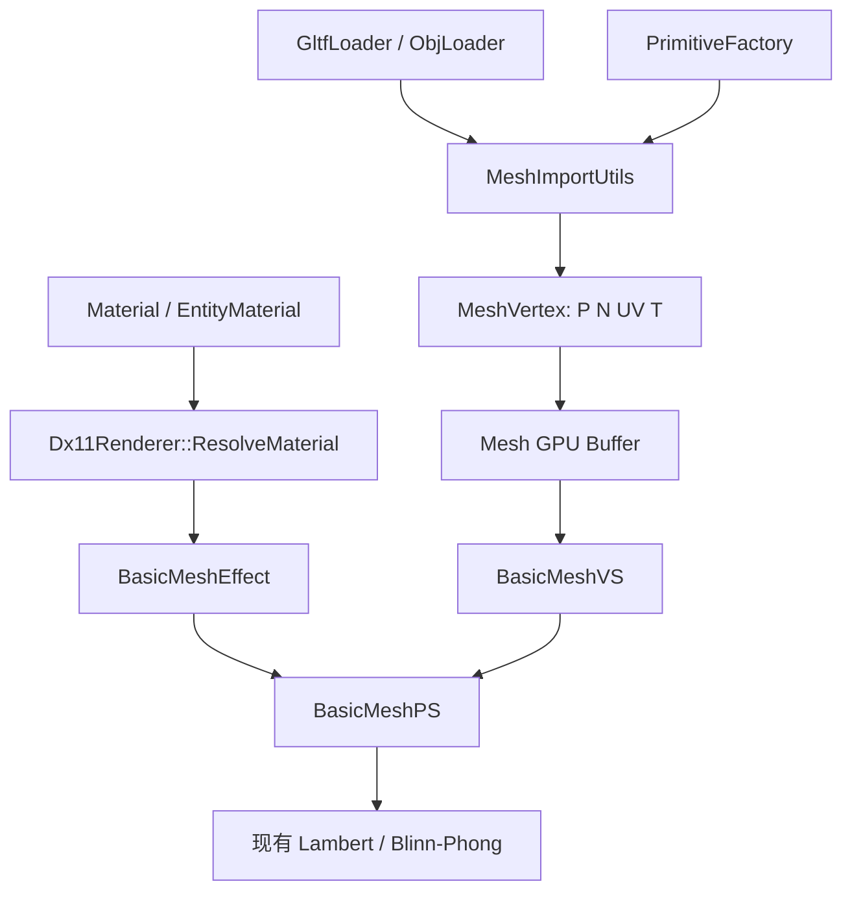
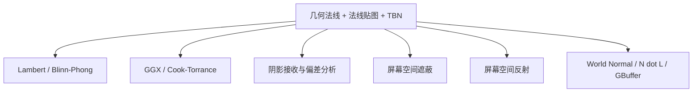

# LRenderDemo 工程实践：法线贴图

## 这次实践的目标

当前工程已经具备：静态网格导入、Position/Normal/UV、BaseColor、Sampler、公共 `b0-b3` CBuffer、基础 Lambert/Blinn-Phong 和 World Normal 调试视图。法线贴图要补上的能力是：

```text
MeshVertex: Position + Normal + UV
                     ↓ 增加 Tangent
Material: BaseColor
                     ↓ 增加 Normal Texture 与约定
BasicMeshVS/PS: worldNormal
                     ↓ 增加 T/B/N 与 TBN
基础光照
                     ↓ 使用 normalMappedWorldNormal
最终画面
```

本章不重新创建独立 Demo，也不提前引入 PBR。先让现有基础光照、资源缓存和 Debug View 经受一项完整材质扩展的验证。

## 工程契约和影响范围

主要边界如下：

| 层 | 当前入口 | 本阶段变化 |
|---|---|---|
| 顶点数据 | `src/render/Mesh.h` 的 `MeshVertex` | 增加切线和 handedness，更新 Input Layout 与上传结构 |
| 程序化几何 | `src/render/PrimitiveFactory.*` | 为 Cube/Sphere/Plane 生成切线，处理退化 UV |
| 导入器 | `src/render/GltfLoader.*`、`ObjLoader.*`、`MeshImportUtils.*` | 读取已有切线；没有时按位置和 UV 重建；处理镜像与退化情况 |
| 材质 | `src/render/Material.*`、`src/core/EntityMaterial.*` | 增加 Normal Texture、启用标志和必要的编辑/序列化字段 |
| 缓存 | `src/render/ResourceCache.*` | 复用法线纹理资源，保持与 BaseColor 相同的生命周期边界 |
| Effect | `src/render/BasicMeshEffect.*` | 增加法线纹理 SRV、绑定槽位和纹理存在性参数 |
| Shader | `src/shaders/BasicMeshVS.hlsl`、`BasicMeshPS.hlsl`、必要时 `common.hlsli` | 传递 T/B/N，解码 normal map，构造世界空间法线 |
| 编辑器 | `src/editor/EditorMaterial.*` | 显示法线贴图状态、开关和 Debug View |
| 调试视图 | `src/render/Dx11Renderer.*`、`EditorLayer.*` | 增加 Tangent、Bitangent、Normal Texture、Mapped Normal 或分步视图 |
| 测试 | `tests/CoreTests.cpp` 或新增针对导入/切线的测试 | 验证正交、handedness、退化 UV 和非均匀缩放 |

修改 `MeshVertex` 会影响 Mesh 创建、导入器和所有 Input Layout，是本阶段最需要先画清楚依赖的地方。



## 推荐的实现顺序

### 0. 先固定学习实验

选择一个有明显凹凸的材质和一个平面或球体，固定窗口尺寸、相机、方向光、曝光和材质颜色。每次只改变一个变量。当前仓库已有 `assets/Resources/Textures/Random/` 下的若干 normal 纹理，具体资源使用前先检查格式、通道约定和是否真的属于该 BaseColor。

建立实验记录：

```text
实验名称：TBN 与法线贴图
代码版本：提交 ID
配置：vs2022-debug
场景：平面 + 单方向光 + 固定相机
变量：normal map / green flip / sRGB / handedness
预期：记录每个 Debug View 的方向和颜色
实际：截图、日志、RenderDoc/PIX 帧
限制：法线贴图不改变轮廓和真实遮挡
```

### 1. 先让顶点切线可见

`MeshVertex` 的最小扩展可以是：

```cpp
struct MeshVertex
{
    DirectX::XMFLOAT3 position;
    DirectX::XMFLOAT3 normal;
    DirectX::XMFLOAT2 textureCoordinate;
    DirectX::XMFLOAT4 tangent; // xyz: T, w: handedness
};
```

`w` 不要默默丢掉。它让 Shader 能在镜像 UV 下恢复副切线方向。若工程决定使用单独的 bitangent，必须明确说明存储和插值代价；本阶段优先采用 `T.xyz + handedness`。

对每个三角形：

1. 计算 `e1/e2` 和 `dUV1/dUV2`；
2. 检查 UV 行列式是否接近 0；
3. 累加三角形切线和副切线到顶点；
4. 用 Gram-Schmidt 让 T 与 N 正交；
5. 通过 `dot(cross(N,T), B)` 推导 handedness；
6. 对无效结果回退到一个与 N 不平行的稳定轴，并记录上下文日志。

退化 UV 是可恢复的数据问题，不能让 NaN 进入 GPU。导入失败时应带文件、Mesh、primitive 和顶点范围上下文；不要用空的 `catch` 吞掉错误。

### 2. 处理程序化几何和导入资产

程序化几何最好先做，因为输入和预期简单：

- 平面：切线沿 U，副切线沿 V；
- 球体：切线沿经度方向，极点处需要稳定回退；
- 立方体：按面生成顶点，不能把不同面硬边的顶点强行共享。

导入器处理顺序建议是：

```text
文件已有 tangent
    → 验证长度、与 normal 的正交性、handedness
文件没有 tangent
    → 按位置/UV/normal 重建
UV 退化或数据无效
    → 记录上下文并使用稳定回退
```

glTF、OBJ 的坐标和绕序转换已经在导入边界完成。切线必须和 Position、Normal 的坐标转换保持同一套约定，不能只翻转位置而忘记翻转切线。当前项目的实际坐标转换细节要以导入器实现和渲染结果复核为准；若发现文档与代码不一致，应标记 `[NEEDS_VERIFY]` 并用一个已知方向的测试三角形确认。

### 3. 增加材质法线纹理

在 `Material` 中增加法线纹理和使用标志，保持 BaseColor 的所有权模式：纹理由 `shared_ptr<Texture2D>` 共享，资源由 `ResourceCache` 复用。

需要明确以下契约：

- normal texture 按 Linear 数据采样；
- 缺失法线纹理时使用几何法线；
- 是否翻转绿色通道是材质或导入设置，不要在 Shader 里写死全局开关；
- normal scale 只能作为明确的学习参数，默认值为 1；
- 贴图的 mipmap、过滤和各向异性设置沿用现有 Sampler，但要记录它们对远处稳定性的影响。

不要把法线纹理塞进 `EntityMaterial.baseColor` 的语义里。材质字段必须表达“它是什么数据”，否则编辑器和序列化会在下一阶段 PBR 时失去边界。

### 4. 扩展 Shader 的 TBN 链

Vertex Shader 输入增加：

```hlsl
struct VertexInput
{
    float3 position : POSITION;
    float3 normal : NORMAL;
    float2 textureCoordinate : TEXCOORD0;
    float4 tangent : TANGENT;
};
```

按当前行向量约定，世界空间变换可以写成：

```hlsl
output.worldNormal = normalize(
    mul(float4(input.normal, 0.0F), C_WorldInverseTranspose).xyz);
output.worldTangent = normalize(
    mul(float4(input.tangent.xyz, 0.0F), C_World).xyz);
output.tangentHandedness = input.tangent.w;
```

在 Pixel Shader 中，先重新正交化插值后的切线，再构造副切线：

```hlsl
float3 n = normalize(input.worldNormal);
float3 t = normalize(input.worldTangent - n * dot(n, input.worldTangent));
float3 b = cross(n, t) * input.tangentHandedness;

float3 tangentNormal = normalTexture.Sample(samplerState, input.uv).xyz;
tangentNormal = normalize(tangentNormal * 2.0F - 1.0F);

float3 worldNormal = normalize(
    tangentNormal.x * t +
    tangentNormal.y * b +
    tangentNormal.z * n);
```

`worldNormal` 才能传给现有 `EvaluateLight` 或 `CalcBlinnPhongLightColor`。不要把 normal map 接在最终颜色之后；它必须替换“参与光照的法线输入”。

### 5. 逐层增加 Debug View

至少增加以下视图，名字要能说明空间：

```text
Lit                  最终光照
World Normal         几何或映射后的世界空间法线
Tangent              世界空间切线
Bitangent            世界空间副切线
Tangent Normal       解码后的切线空间法线
Normal Texture       原始 RGB 数据
N dot L              法线与光方向的夹角贡献
```

每个方向映射到颜色时使用 `0.5 * direction + 0.5`，并在 UI 中写清“颜色是编码后的方向，不是材质颜色”。`N dot L` 则适合使用灰度显示，便于区别方向错误和颜色空间错误。

### 6. 故障注入顺序

按一次只破坏一层的顺序进行：

1. 不使用 normal map，确认基础画面不变；
2. 使用 `(0.5,0.5,1.0)` 平面法线，确认结果接近几何法线；
3. 翻转绿色通道，记录凹凸反转；
4. 忽略 handedness，检查镜像 UV 区域；
5. 把 normal texture 当 sRGB，比较高光和 `N dot L`；
6. 删除 normalize，观察过滤后强度变化；
7. 把世界法线错误地乘 `C_World`，用非均匀缩放验证法线与切线的错误。

每个故障都要有“预测 → 运行 → 现象 → 定位 → 修复”的记录。只截最终正确图不能证明掌握。

## 验收和测试

### CPU 测试

建议增加纯数学辅助函数测试，不依赖窗口：

- 正常 UV 三角形产生有限且接近单位长度的 T；
- `abs(dot(N,T))` 小于容差；
- 镜像 UV 得到相反 handedness；
- 退化 UV 不产生 NaN/Inf，并走稳定回退；
- 非均匀缩放后，变换后的 N 与 T 仍近似正交；
- `(0.5,0.5,1.0)` 解码结果接近 `(0,0,1)`。

### GPU / 人工验收

- 平面、球体和至少一个导入模型都能显示 normal map；
- 开关 normal map 后 BaseColor 和光源行为可解释；
- World Normal、Tangent、Bitangent、Tangent Normal 视图方向连续；
- 镜像 UV 没有半边凹凸翻转；
- 正确、绿色翻转、错误 sRGB、错误 handedness 各有截图；
- RenderDoc 或 PIX 中能看到法线 SRV 绑定、采样格式和对应 Draw；
- 对比关闭与开启法线贴图的 GPU 时间，记录硬件、分辨率和场景；
- 工程构建和 CTest 通过。

## 常见工程陷阱

1. **只给 Shader 加输入，却忘了 Input Layout**：顶点数据会错位，表现为模型爆炸或颜色完全异常。
2. **CPU 结构和 HLSL 语义不同步**：`TANGENT` 的格式、步长和偏移必须同时修改。
3. **把 Tangent 当 Normal 处理**：切线受模型缩放影响的规则和法线不同；法线需要逆转置，切线通常使用世界矩阵后再正交化。
4. **共享硬边顶点**：法线、UV、切线不连续时必须拆点。
5. **只检查最终 Lit**：黑屏、高光错误、纹理格式和 TBN 错误会混在一起；必须保留中间 Debug View。
6. **把所有紫色纹理都当法线**：颜色相近不等于语义相同，必须依据资产元数据或人工确认。
7. **默认 normal map 一定存在**：导入资产、程序化材质和旧场景都需要几何法线回退。

## 这项能力为后续章节提供什么

法线贴图完成后，后续章节可以复用同一个法线来源：



如果这一步没有把空间、切线、色彩和资源绑定讲清楚，后面的 PBR、SSAO、SSR 出现错误时会同时失去多个诊断入口。

## 三分钟源码讲解提纲

1. `MeshVertex` 为什么多了 `float4 tangent`，`w` 表示什么；
2. 导入器何时读取切线，何时重建，退化 UV 如何处理；
3. `Material` 如何表达 normal texture 的存在性和线性数据语义；
4. Vertex Shader 如何把 N/T 送到世界空间；
5. Pixel Shader 如何用 `cross`、handedness 和采样结果构造 TBN；
6. 最终光照为什么使用映射后的世界法线；
7. 哪个 Debug View 能最快区分绿色通道错误和矩阵空间错误。

## 练习区

### 正文回顾题

1. 在本工程中，为什么 normal texture 不应放进 BaseColor 的字段或显示模式？
2. `MeshVertex` 增加字段后，至少哪些 CPU/GPU 边界必须同步修改？
3. 为什么 Pixel Shader 还要对插值后的 T 做一次正交化？
4. 当一个导入模型只有 Position、Normal、UV 时，如何生成 Tangent？
5. 为什么 normal texture 的资源格式和 BaseColor 的资源格式不能默认相同？

### 工程调试题

1. 开启法线贴图后，所有物体变黑，但 `Normal Texture` 视图正常。请按资源格式、解码、TBN、光照输入顺序列出排查步骤。
2. 模型只有镜像 UV 的右半边出现相反凹凸。你会检查哪个顶点字段，如何用 Debug View 证明？
3. 非均匀缩放后，高光随物体旋转漂移。请指出可能错误的矩阵和一个最小故障注入实验。
4. RenderDoc 显示法线 SRV 绑定到了 Pixel Shader，但画面没有变化。请列出至少三种“绑定正确但结果不变”的原因。

### 答案要点

1. 依次确认 SRV 是否是 Linear 数据、采样值是否解码到 `[-1,1]`、是否 normalize、T/B/N 是否同一空间、最终是否把 mapped normal 传给光照函数。
2. 检查 `tangent.w` 与 `cross(N,T)` 的方向；把 `Bitangent` 编码为颜色，镜像区域应显示相反方向。
3. 法线使用 `WorldInverseTranspose`，切线使用 World 后正交化；把 `World` 错用于法线，并只改变缩放矩阵即可重现。
4. 可能是材质启用标志为假、Shader 仍使用几何法线、采样器/UV 错误、法线贴图是平面 `(0.5,0.5,1)`、或光照方向让两者差异暂时不可见。
