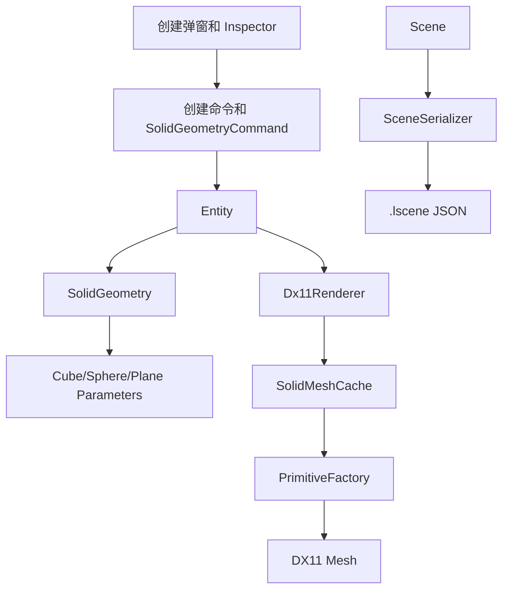

# 参数化 Solid 与场景保存指南

## 功能边界

当前 Cube、Sphere 和 Plane 不再只保存类型枚举，而是由 `SolidGeometry` 保存可编辑参数。渲染器仍在
CPU 端生成顶点和索引，再创建不可变 DX11 Buffer；这一步尚未改为 GPU 参数化生成。

场景保存使用 `.lscene` JSON 文件，记录 Model、Entity、几何参数、变换、材质和外部资源引用，
不保存 DX11 对象、运行时缓存、撤销栈、相机、灯光或 ImGui 布局。

## 数据与调用关系



创建参数化球体的核心调用为：

```cpp
Entity& sphere = scene.CreateSolidEntity(
    modelId,
    SolidGeometry::Sphere({
        .radius = 1.25F,
        .slices = 48,
        .stacks = 24,
    }),
    "Sphere");
```

`SolidMeshCache::Resolve(entity.id, *entity.Solid())` 比较当前参数和上次生成参数。参数相同则复用 Mesh；
参数改变则只替换该 Entity 的运行时 Mesh。缓存不进入 Scene，也不会写入文件。

## 编辑规则

- Cube 支持宽、高、深。
- Sphere 支持半径、经度分段和纬度分段。
- Plane 支持宽、深和 X/Z 细分数。
- 尺寸和半径必须有限且不小于 `0.001`。
- 编辑器将细分数限制在 256 以内；Core 仍执行最低拓扑要求校验。
- Inspector 拖动尺寸时实时重建画面；一次连续拖动只产生一条撤销记录。
- `SolidGeometry` 尺寸表示真实几何参数，`Transform::scale` 表示场景实例变换，两者含义不同。

## 保存与加载

菜单和快捷键：

| 操作 | 菜单 | 快捷键 |
|---|---|---|
| 新建场景 | `File > New` | `Ctrl+N` |
| 打开场景 | `File > Open...` | `Ctrl+O` |
| 保存 | `File > Save` | `Ctrl+S` |
| 另存为 | `File > Save As...` | `Ctrl+Shift+S` |

程序接口：

```cpp
SceneSerializer::Save(scene, "scenes/example.lscene");
Scene loaded = SceneSerializer::Load("scenes/example.lscene");
```

保存时先写同目录临时文件，再替换目标文件。加载时先构造临时 Scene，并预加载文件引用的模型和自定义
贴图；全部成功后才替换编辑中的 Scene。失败会记录日志并保留原场景。

模型和贴图优先保存为相对于 `.lscene` 的 UTF-8 路径。单独复制场景文件并不会复制依赖资源；跨机器
使用时需要保持相对目录结构。当前格式版本为 1，未知版本会被拒绝，避免静默误读。

## 后续 GPU 生成边界

未来 GPU 生成仍以 `SolidGeometry` 为输入，只替换 `SolidMeshCache + PrimitiveFactory`。Scene、命令、
Inspector 和 `.lscene` 字段无需改变。加入 GPU 位移时，应在参数中声明可计算的最大位移，不能通过
同步回读 GPU 顶点维持普通编辑操作。
